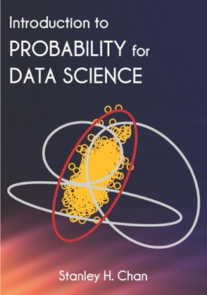
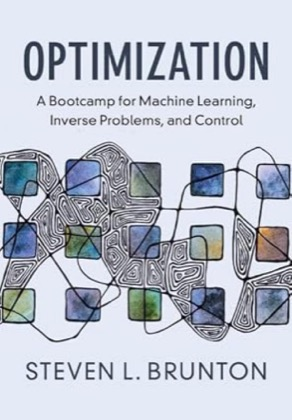
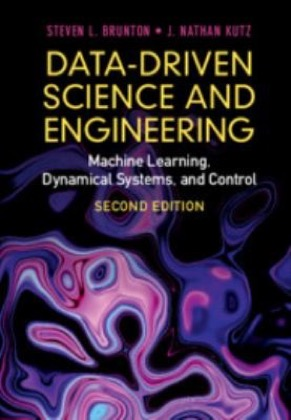
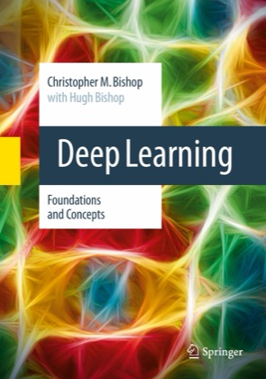
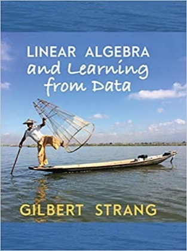
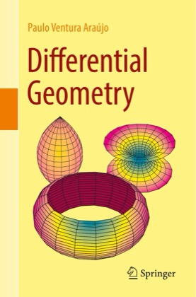
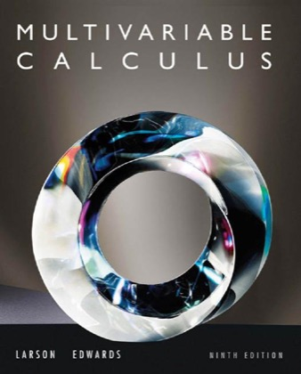
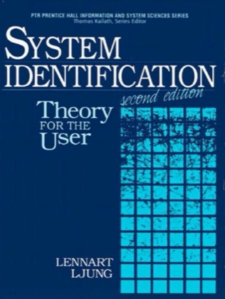
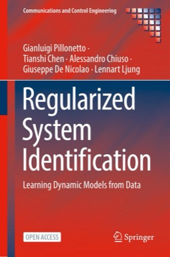

[⬅ Site principal](https://raphateixeira.github.io)

Notas de fundamentação teórica por tema de estudo e notas de leitura de livros-texto, em
slides.

## Fundamentos

Temas sistematizados a partir das notas de leitura dos livros. Cada tema nasce aqui e, quando
ganha volume, é promovido a repositório próprio.

```{=html}
<style>
  .temas-grid { display: grid; grid-template-columns: repeat(auto-fill, minmax(260px, 1fr)); gap: 1.2rem; margin: 1.5rem 0; }
  .tema-card { display: flex; flex-direction: column; border: 1px solid #ddd; border-top: 4px solid #1B365D; border-radius: 8px; padding: 1rem 1.1rem; text-decoration: none !important; color: inherit !important; background: #fff; transition: box-shadow .15s ease, transform .15s ease; }
  .tema-card:hover { box-shadow: 0 4px 14px rgba(27,54,93,.18); transform: translateY(-2px); }
  .tema-card h3 { font-size: 1.1rem; margin: .3rem 0 .4rem; color: #1B365D; border: 0; padding: 0; }
  .tema-card p { font-size: .88rem; color: #444; margin: 0 0 .7rem; line-height: 1.35; }
  .tema-estado { align-self: flex-start; font-size: .68rem; text-transform: uppercase; letter-spacing: .05em; font-weight: 700; color: #E65100; background: #FFF3E0; border-radius: 999px; padding: .1rem .55rem; }
  .tema-fontes { margin-top: auto; font-size: .76rem; color: #666; border-top: 1px solid #eee; padding-top: .5rem; }
</style>
<div class="temas-grid">
<a class="tema-card" href="fundamentos/identificacao-sistemas/index.html">
  <span class="tema-estado">em construção</span>
  <h3>Identificação de Sistemas</h3>
  <p>Modelagem a partir de dados: mínimos quadrados, sinais PRBS, modelos ARX e LIT; extensão para métodos regularizados.</p>
  <div class="tema-fontes">Fontes: Ljung, Pillonetto et al., Brunton & Kutz</div>
</a>
<a class="tema-card" href="fundamentos/controle-mpc/index.html">
  <span class="tema-estado">em construção</span>
  <h3>Controle Preditivo (MPC)</h3>
  <p>MPC baseado em modelo e MPC direto sobre dados (DeePC), com o exemplo do sistema massa-mola-amortecedor.</p>
  <div class="tema-fontes">Fontes: Brunton, Brunton & Kutz</div>
</a>
<a class="tema-card" href="fundamentos/controle-digital/index.html">
  <span class="tema-estado">em construção</span>
  <h3>Controle Digital</h3>
  <p>Discretização, estabilidade e projeto de controladores digitais.</p>
  <div class="tema-fontes">Fontes: a definir</div>
</a>
<a class="tema-card" href="fundamentos/conversores-energia/index.html">
  <span class="tema-estado">em construção</span>
  <h3>Conversores de Energia</h3>
  <p>Conversores estáticos CC-CC e CC-CA: modelagem, dispositivos e controle.</p>
  <div class="tema-fontes">Fontes: Komurcugil et al.</div>
</a>
</div>
```

## Livros

Notas de leitura em slides (Quarto revealjs), uma pasta por livro-texto. Os PDFs dos livros
não fazem parte deste repositório.

```{=html}
<style>
  .livros-grid { display: grid; grid-template-columns: repeat(auto-fill, minmax(190px, 1fr)); gap: 1.4rem; margin: 1.5rem 0; }
  .livro-card { display: flex; flex-direction: column; border: 1px solid #ddd; border-radius: 8px; overflow: hidden; text-decoration: none !important; color: inherit !important; background: #fff; transition: box-shadow .15s ease, border-color .15s ease, transform .15s ease; }
  .livro-card:hover { border-color: #1B365D; box-shadow: 0 4px 14px rgba(27,54,93,.18); transform: translateY(-2px); }
  .livro-card img { width: 100%; aspect-ratio: 2 / 3; object-fit: cover; object-position: top; background: #f2f4f7; border-bottom: 1px solid #eee; margin: 0; }
  .livro-card .livro-info { padding: .7rem .8rem .9rem; }
  .livro-card h3 { font-size: .92rem; line-height: 1.25; margin: 0 0 .3rem; color: #1B365D; border: 0; padding: 0; }
  .livro-card p { font-size: .78rem; color: #555; margin: 0; line-height: 1.3; }
</style>
```


```{=html}
<div class="livros-grid">
<a class="livro-card" href="leituras/chan-probabilidade/index.html">
  
  <div class="livro-info"><h3>Introduction to Probability for Data Science</h3><p>Stanley H. Chan</p></div>
</a>
<a class="livro-card" href="leituras/brunton-otimizacao/index.html">
  
  <div class="livro-info"><h3>Optimization: A Bootcamp for ML, Inverse Problems, and Control</h3><p>Steven L. Brunton</p></div>
</a>
<a class="livro-card" href="leituras/brunton-kutz-data-driven/index.html">
  
  <div class="livro-info"><h3>Data-Driven Science and Engineering</h3><p>Steven L. Brunton, J. Nathan Kutz</p></div>
</a>
<a class="livro-card" href="leituras/bishop-deep-learning/index.html">
  
  <div class="livro-info"><h3>Deep Learning: Foundations and Concepts</h3><p>Christopher M. Bishop, Hugh Bishop</p></div>
</a>
<a class="livro-card" href="leituras/strang-linear-algebra/index.html">
  
  <div class="livro-info"><h3>Linear Algebra and Learning from Data</h3><p>Gilbert Strang</p></div>
</a>
<a class="livro-card" href="leituras/ventura-geometria-diferencial/index.html">
  
  <div class="livro-info"><h3>Differential Geometry</h3><p>Paulo Ventura Araújo</p></div>
</a>
<a class="livro-card" href="leituras/larson-calculo-multivariavel/index.html">
  
  <div class="livro-info"><h3>Multivariable Calculus</h3><p>Ron Larson, Bruce H. Edwards</p></div>
</a>
<a class="livro-card" href="leituras/hasan-advanced-control-power-converters/index.html">
  
  <div class="livro-info"><h3>Advanced Control of Power Converters</h3><p>Hasan Komurcugil, Sertac Bayhan, Ramon Guzman, Mariusz Malinowski, Haitham Abu-Rub</p></div>
</a>
<a class="livro-card" href="leituras/ljung-system-identification/index.html">
  
  <div class="livro-info"><h3>System Identification: Theory for the User</h3><p>Lennart Ljung</p></div>
</a>
<a class="livro-card" href="leituras/pillonetto-regularized-system-identification/index.html">
  
  <div class="livro-info"><h3>Regularized System Identification: Learning Dynamic Models from Data</h3><p>Gianluigi Pillonetto, Tianshi Chen, Alessandro Chiuso, Giuseppe De Nicolao, Lennart Ljung</p></div>
</a>
</div>
```
