## Sumário {.smaller}

- **11.1.1** Segmentos orientados e a definição de vetor
- **11.1.2** Operações com vetores e suas propriedades
- **11.1.3** Vetores unitários padrão
- **11.1.4** Aplicações: força e velocidade
- **Derivações** dos teoremas 11.1–11.3

# 11.1.1 — Segmentos Orientados e a Definição de Vetor

## Grandezas escalares e vetoriais

- Grandezas **escalares** (área, volume, temperatura, massa, tempo) são caracterizadas por um único número real.
- Grandezas como força, velocidade e aceleração envolvem magnitude **e** direção.
- São representadas por um **segmento de reta orientado** $\overrightarrow{PQ}$, com ponto inicial $P$ e ponto terminal $Q$; seu comprimento (magnitude) é $\|\overrightarrow{PQ}\|$.

## Segmentos orientados equivalentes

Segmentos orientados com mesmo comprimento e mesma direção são **equivalentes**. Um **vetor no plano** $\mathbf{v} = \overrightarrow{PQ}$ é o conjunto de todos os segmentos orientados equivalentes a um dado $\overrightarrow{PQ}$ — na prática, não se distingue entre o vetor e um de seus representantes.

::: {layout-ncol=2}
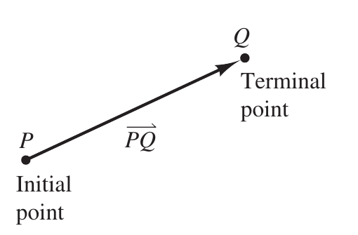

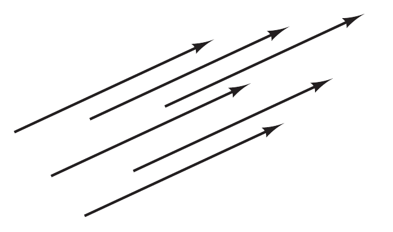
:::

## Exemplo 1 — representação por segmentos orientados

Sejam $\mathbf{v}$ o segmento de $(0,0)$ a $(3,2)$ e $\mathbf{u}$ o segmento de $(1,2)$ a $(4,4)$. Com $P(0,0), Q(3,2), R(1,2), S(4,4)$, a Fórmula da Distância dá
$$\|\overrightarrow{PQ}\| = \|\overrightarrow{RS}\| = \sqrt{13},$$
e as inclinações coincidem, $2/3$ em ambos os casos — logo $\overrightarrow{PQ}$ e $\overrightarrow{RS}$ têm mesmo comprimento e mesma direção, e $\mathbf{v}$ e $\mathbf{u}$ são equivalentes.

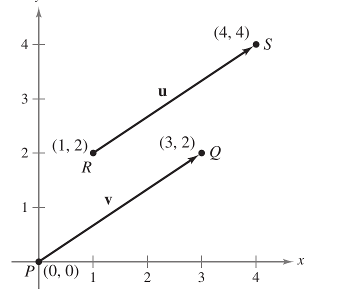{width="45%" fig-align="center"}

## Vetor em posição padrão

O segmento orientado cujo ponto inicial é a origem é o representante mais conveniente de uma classe de equivalência; diz-se que $\mathbf{v}$ está em **posição padrão**, e fica unicamente determinado pelas coordenadas do ponto terminal $Q(v_1, v_2)$.

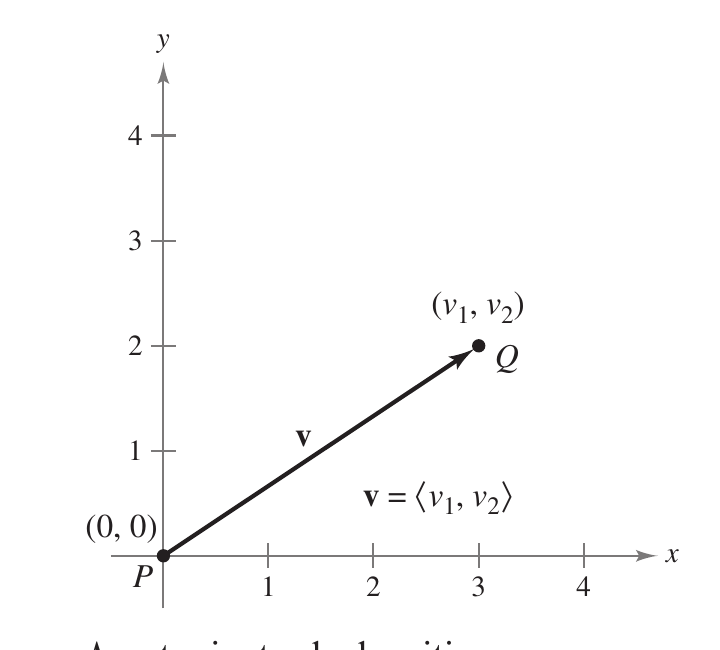{width="45%" fig-align="center"}

## Definição: forma de componentes de um vetor no plano

::: {.callout-note title="Definição"}
Se $\mathbf{v}$ tem ponto inicial na origem e ponto terminal $(v_1, v_2)$, sua forma de componentes é $\mathbf{v} = \langle v_1, v_2 \rangle$. Os números $v_1, v_2$ são as **componentes** de $\mathbf{v}$. Se ambos os pontos estão na origem, $\mathbf{v}$ é o **vetor nulo** $\mathbf{0} = \langle 0, 0 \rangle$.
:::

Dessa definição, $\mathbf{u} = \mathbf{v}$ sse $u_1 = v_1$ e $u_2 = v_2$.

## Conversões entre segmento orientado e componentes

1. Se $P(p_1,p_2)$ e $Q(q_1,q_2)$ são os pontos inicial e terminal de $\overrightarrow{PQ}$, o vetor representado tem forma de componentes $\mathbf{v} = \langle q_1 - p_1,\, q_2 - p_2 \rangle$, e sua magnitude é
   $$\|\mathbf{v}\| = \sqrt{(q_1-p_1)^2 + (q_2-p_2)^2} = \sqrt{v_1^2 + v_2^2}.$$
2. Se $\mathbf{v} = \langle v_1, v_2 \rangle$, $\mathbf{v}$ pode ser representado em posição padrão, de $P(0,0)$ a $Q(v_1,v_2)$.

A magnitude também é chamada **norma** de $\mathbf{v}$; se $\|\mathbf{v}\| = 1$, $\mathbf{v}$ é um **vetor unitário**, e $\|\mathbf{v}\| = 0$ sse $\mathbf{v} = \mathbf{0}$.

## Exemplo 2 — forma de componentes e comprimento

Com ponto inicial $P(3,-7)$ e terminal $Q(-2,5)$, $v_1 = q_1-p_1 = -2-3 = -5$ e $v_2 = q_2-p_2 = 5-(-7) = 12$, logo
$$\mathbf{v} = \langle -5, 12 \rangle \quad \text{e} \quad \|\mathbf{v}\| = \sqrt{(-5)^2+12^2} = \sqrt{169} = 13.$$

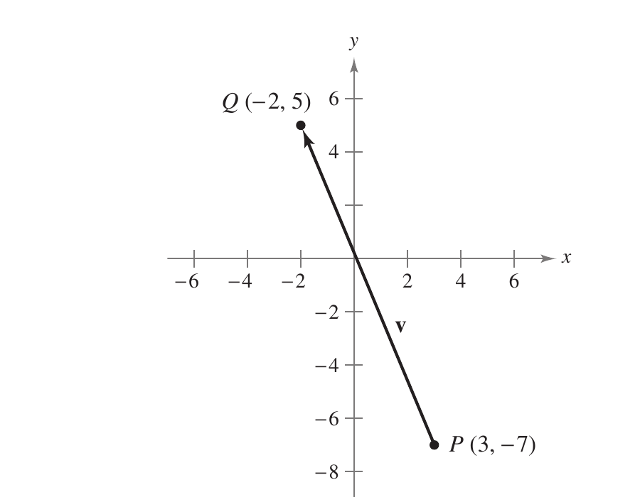{width="50%" fig-align="center"}

# 11.1.2 — Operações com Vetores e suas Propriedades

## Definição: adição e multiplicação por escalar

::: {.callout-note title="Definição"}
Sejam $\mathbf{u} = \langle u_1, u_2 \rangle$, $\mathbf{v} = \langle v_1, v_2 \rangle$ e $c$ um escalar.

1. Soma: $\mathbf{u} + \mathbf{v} = \langle u_1+v_1,\, u_2+v_2 \rangle$.
2. Múltiplo escalar: $c\mathbf{u} = \langle cu_1,\, cu_2 \rangle$.
3. Negativo: $-\mathbf{v} = (-1)\mathbf{v} = \langle -v_1, -v_2 \rangle$.
4. Diferença: $\mathbf{u} - \mathbf{v} = \mathbf{u} + (-\mathbf{v}) = \langle u_1-v_1,\, u_2-v_2\rangle$.
:::

## Interpretação geométrica das operações

Geometricamente, $c\mathbf{v}$ tem comprimento $|c|$ vezes o de $\mathbf{v}$: mesma direção se $c>0$, direção oposta se $c<0$.

A soma $\mathbf{u}+\mathbf{v}$ — o **vetor resultante** — é a diagonal do paralelogramo com lados adjacentes $\mathbf{u}$ e $\mathbf{v}$; equivalentemente, move-se o ponto inicial de um vetor até o ponto terminal do outro (regra do triângulo).

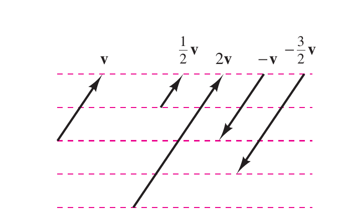{width="50%" fig-align="center"}

## Soma, múltiplo escalar e subtração

::: {layout-ncol=2}
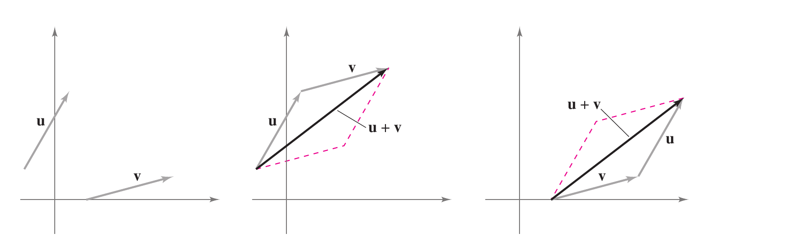

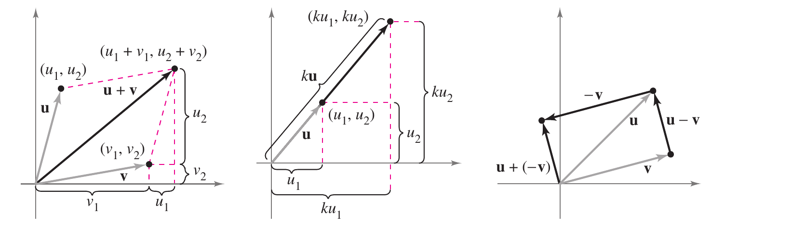
:::

## Exemplo 3 — operações vetoriais

Com $\mathbf{v} = \langle -2,5 \rangle$ e $\mathbf{w} = \langle 3,4 \rangle$:

a. $\dfrac{1}{2}\mathbf{v} = \left\langle \dfrac{1}{2}(-2), \dfrac{1}{2}(5)\right\rangle = \left\langle -1, \dfrac{5}{2} \right\rangle$
b. $\mathbf{w} - \mathbf{v} = \langle 3-(-2),\, 4-5 \rangle = \langle 5, -1 \rangle$
c. $\mathbf{v} + 2\mathbf{w} = \langle -2,5\rangle + \langle 6,8\rangle = \langle 4, 13 \rangle$

## Teorema 11.1 — propriedades das operações vetoriais

::: {.callout-important title="Teorema 11.1"}
Para vetores $\mathbf{u},\mathbf{v},\mathbf{w}$ no plano e escalares $c,d$:

1. $\mathbf{u}+\mathbf{v} = \mathbf{v}+\mathbf{u}$ (comutativa)
2. $(\mathbf{u}+\mathbf{v})+\mathbf{w} = \mathbf{u}+(\mathbf{v}+\mathbf{w})$ (associativa)
3. $\mathbf{u}+\mathbf{0} = \mathbf{u}$ (identidade aditiva)
4. $\mathbf{u}+(-\mathbf{u}) = \mathbf{0}$ (inverso aditivo)
5. $c(d\mathbf{u}) = (cd)\mathbf{u}$
6. $(c+d)\mathbf{u} = c\mathbf{u}+d\mathbf{u}$ (distributiva)
7. $c(\mathbf{u}+\mathbf{v}) = c\mathbf{u}+c\mathbf{v}$ (distributiva)
8. $1\mathbf{u} = \mathbf{u}$, $\;0\mathbf{u} = \mathbf{0}$
:::

Qualquer conjunto de vetores (com escalares) que satisfaça essas oito propriedades é um **espaço vetorial** — os oito itens são os axiomas de espaço vetorial, e o teorema afirma que os vetores do plano (com os reais) formam um.

## Teorema 11.2 — comprimento de um múltiplo escalar

::: {.callout-important title="Teorema 11.2"}
Para vetor $\mathbf{v}$ e escalar $c$: $\|c\mathbf{v}\| = |c|\,\|\mathbf{v}\|$.
:::

## Teorema 11.3 — vetor unitário na direção de $\mathbf v$

::: {.callout-important title="Teorema 11.3"}
Se $\mathbf{v} \neq \mathbf{0}$,
$$\mathbf{u} = \frac{\mathbf{v}}{\|\mathbf{v}\|} = \frac{1}{\|\mathbf{v}\|}\mathbf{v}$$
tem comprimento $1$ e mesma direção que $\mathbf{v}$. Esse processo é a **normalização** de $\mathbf{v}$.
:::

## Desigualdade triangular

Em geral o comprimento de uma soma não é a soma dos comprimentos: com $\mathbf{u}$ e $\mathbf{v}$ como dois lados de um triângulo, o terceiro lado tem comprimento $\|\mathbf{u}+\mathbf{v}\|$, donde a
$$\|\mathbf{u}+\mathbf{v}\| \le \|\mathbf{u}\| + \|\mathbf{v}\|,$$
com igualdade sse $\mathbf{u}$ e $\mathbf{v}$ têm a mesma direção (provada via produto escalar no Exercício 91 de §11.3).

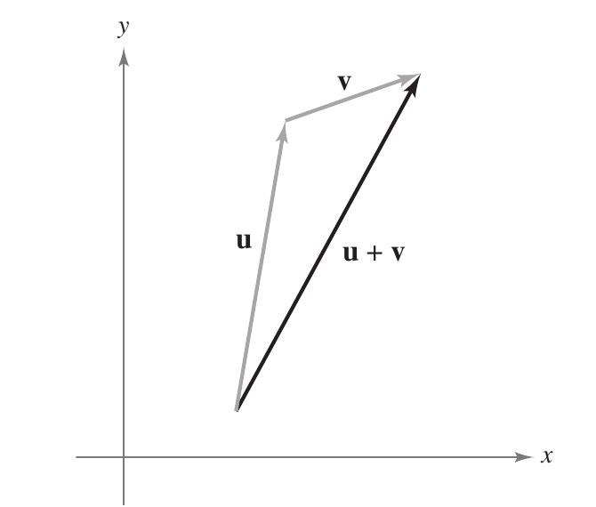{width="45%" fig-align="center"}

## Exemplo 4 — vetor unitário

Para $\mathbf{v} = \langle -2, 5 \rangle$, pelo Teorema 11.3,
$$\frac{\mathbf{v}}{\|\mathbf{v}\|} = \frac{\langle -2,5\rangle}{\sqrt{(-2)^2+5^2}} = \frac{1}{\sqrt{29}}\langle -2,5\rangle = \left\langle \frac{-2}{\sqrt{29}}, \frac{5}{\sqrt{29}} \right\rangle,$$
de comprimento $1$: $\sqrt{(-2/\sqrt{29})^2 + (5/\sqrt{29})^2} = \sqrt{4/29+25/29} = \sqrt{29/29} = 1$.

# 11.1.3 — Vetores Unitários Padrão

## Os vetores $\mathbf i$ e $\mathbf j$

Os vetores unitários $\mathbf{i} = \langle 1,0\rangle$ e $\mathbf{j} = \langle 0,1\rangle$ são os **vetores unitários padrão** do plano. Todo vetor se escreve unicamente como combinação deles:
$$\mathbf{v} = \langle v_1,v_2\rangle = v_1\langle 1,0\rangle + v_2\langle 0,1\rangle = v_1\mathbf{i} + v_2\mathbf{j}.$$
Diz-se que $\mathbf{v} = v_1\mathbf{i}+v_2\mathbf{j}$ é uma **combinação linear** de $\mathbf{i}$ e $\mathbf{j}$, com componentes horizontal $v_1$ e vertical $v_2$.

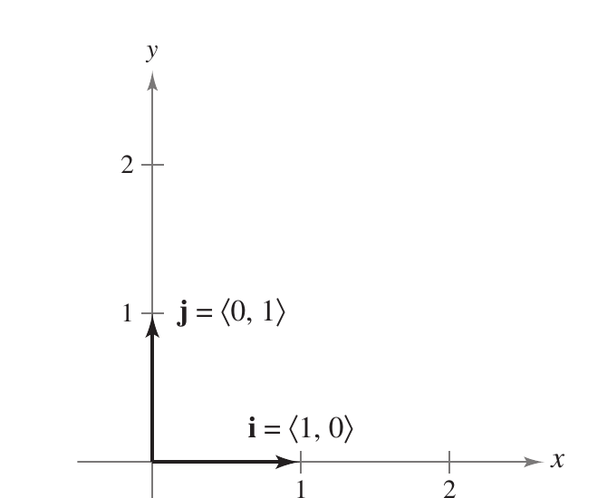{width="45%" fig-align="center"}

## Exemplo 5 — combinação linear de vetores unitários

Seja $\mathbf{u}$ o vetor de ponto inicial $(2,-5)$ a ponto terminal $(-1,3)$, e $\mathbf{v} = 2\mathbf{i}-\mathbf{j}$.

a. $\mathbf{u} = \langle -1-2,\, 3-(-5)\rangle = \langle -3,8\rangle = -3\mathbf{i}+8\mathbf{j}$
b. $\mathbf{w} = 2\mathbf{u}-3\mathbf{v} = 2(-3\mathbf{i}+8\mathbf{j}) - 3(2\mathbf{i}-\mathbf{j}) = -6\mathbf{i}+16\mathbf{j}-6\mathbf{i}+3\mathbf{j} = -12\mathbf{i}+19\mathbf{j}$

## Ângulo e vetor unitário no círculo

Se $\mathbf{u}$ é unitário e $\theta$ é o ângulo (medido a partir do eixo $x$ positivo, sentido anti-horário) até $\mathbf{u}$, seu ponto terminal está no círculo unitário:
$$\mathbf{u} = \langle \cos\theta,\sin\theta\rangle = \cos\theta\,\mathbf{i}+\sin\theta\,\mathbf{j}.$$
Qualquer vetor não nulo $\mathbf{v}$ fazendo ângulo $\theta$ com o eixo $x$ positivo tem a mesma direção de $\mathbf{u}$, e
$$\mathbf{v} = \|\mathbf{v}\|\langle\cos\theta,\sin\theta\rangle = \|\mathbf{v}\|\cos\theta\,\mathbf{i} + \|\mathbf{v}\|\sin\theta\,\mathbf{j}.$$

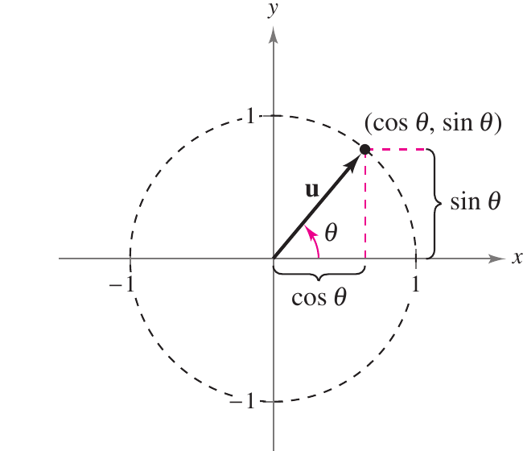{width="45%" fig-align="center"}

## Exemplo 6 — vetor de magnitude e direção dadas

$\mathbf{v}$ tem magnitude $3$ e ângulo $30° = \pi/6$ com o eixo $x$ positivo:
$$\mathbf{v} = 3\cos\frac{\pi}{6}\mathbf{i} + 3\sin\frac{\pi}{6}\mathbf{j} = \frac{3\sqrt{3}}{2}\mathbf{i} + \frac{3}{2}\mathbf{j}.$$

# 11.1.4 — Aplicações: Força e Velocidade

## Força resultante

Um vetor pode representar **força**, por ter magnitude e direção. Se várias forças atuam sobre um objeto, a **força resultante** é a soma vetorial das forças.

## Exemplo 7 — força resultante

Dois rebocadores empurram um transatlântico, cada um exercendo $400$ libras a $\pm 20°$ do eixo $x$:
$$\mathbf{F}_1 = 400\langle\cos 20°,\sin 20°\rangle, \qquad \mathbf{F}_2 = 400\langle\cos(-20°),\sin(-20°)\rangle.$$
A resultante é
$$\mathbf{F} = \mathbf{F}_1+\mathbf{F}_2 = 800\cos(20°)\,\mathbf{i} \approx 752\,\mathbf{i},$$
ou seja, aproximadamente $752$ libras na direção do eixo $x$ positivo — as componentes verticais se cancelam por simetria.

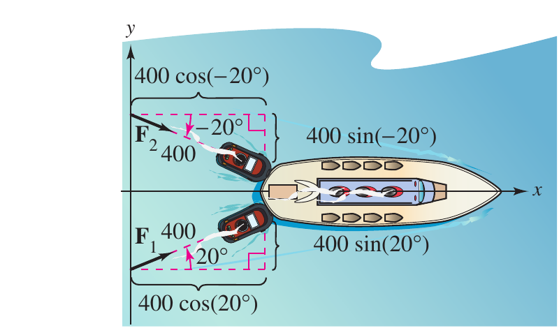{width="70%" fig-align="center"}

## Rumo e velocidade

Em navegação, um **rumo** (*bearing*) é a direção que mede o ângulo agudo que uma trajetória faz com uma linha norte-sul fixa; em navegação aérea, rumos são medidos em graus no sentido horário a partir do norte.

## Exemplo 8 — velocidade resultante

Um avião voa a $500$ mph com rumo $330°$ sem vento:
$$\mathbf{v}_1 = 500\cos(120°)\,\mathbf{i} + 500\sin(120°)\,\mathbf{j}.$$
Ao encontrar um vento de $70$ mph na direção N$45°$E,
$$\mathbf{v}_2 = 70\cos(45°)\,\mathbf{i} + 70\sin(45°)\,\mathbf{j},$$
e a velocidade resultante é
$$\mathbf{v} = \mathbf{v}_1+\mathbf{v}_2 \approx -200{,}5\,\mathbf{i} + 482{,}5\,\mathbf{j}.$$

## Exemplo 8 — velocidade resultante (continuação)

Com $\|\mathbf{v}\| \approx \sqrt{(-200{,}5)^2+(482{,}5)^2} \approx 522{,}5$,
$$\mathbf{v} \approx 522{,}5\left[\cos(112{,}6°)\,\mathbf{i}+\sin(112{,}6°)\,\mathbf{j}\right],$$
isto é, velocidade alterada para $\approx 522{,}5$ mph, em trajetória a $\approx 112{,}6°$ do eixo $x$ positivo.

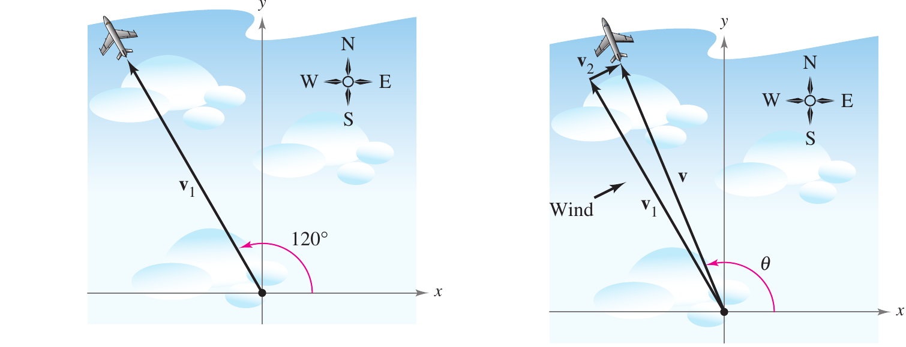{width="95%" fig-align="center"}

# Derivações

## Teorema 11.1 — propriedade associativa

Usa a associatividade da soma de reais:
$$(\mathbf{u}+\mathbf{v})+\mathbf{w} = \langle u_1+v_1,u_2+v_2\rangle + \langle w_1,w_2\rangle = \langle (u_1+v_1)+w_1,\, (u_2+v_2)+w_2\rangle$$
$$= \langle u_1+(v_1+w_1),\, u_2+(v_2+w_2)\rangle = \mathbf{u}+(\mathbf{v}+\mathbf{w}).$$

## Teorema 11.1 — propriedade distributiva

$(c+d)\mathbf u = c\mathbf u + d\mathbf u$ usa a distributividade dos reais:
$$(c+d)\mathbf{u} = \langle (c+d)u_1,\,(c+d)u_2\rangle = \langle cu_1+du_1,\, cu_2+du_2\rangle = c\mathbf{u}+d\mathbf{u}.$$

## Teorema 11.2 — derivação

Com $c\mathbf{v}=\langle cv_1,cv_2\rangle$,
$$\|c\mathbf{v}\| = \sqrt{(cv_1)^2+(cv_2)^2} = \sqrt{c^2(v_1^2+v_2^2)} = |c|\sqrt{v_1^2+v_2^2} = |c|\,\|\mathbf{v}\|.$$

## Teorema 11.3 — derivação

Como $1/\|\mathbf v\|>0$, $\mathbf{u}=(1/\|\mathbf v\|)\mathbf{v}$ tem a mesma direção de $\mathbf{v}$; pelo Teorema 11.2,
$$\|\mathbf{u}\| = \left\|\frac{1}{\|\mathbf{v}\|}\mathbf{v}\right\| = \left|\frac{1}{\|\mathbf{v}\|}\right|\|\mathbf{v}\| = \frac{1}{\|\mathbf{v}\|}\|\mathbf{v}\| = 1.$$

$$\boxed{\|\mathbf{u}\|=1} \quad \text{— } \mathbf{u} \text{ é unitário, na mesma direção de } \mathbf{v}.$$

## Resumo da aula {.smaller}

- **11.1.1** — Segmento orientado $\overrightarrow{PQ}$; vetor como classe de equivalência; forma de componentes $\mathbf v=\langle v_1,v_2\rangle$ e norma $\|\mathbf v\|$.
- **11.1.2** — Soma, múltiplo escalar, negativo e diferença; Teorema 11.1 (vetores do plano formam um espaço vetorial); Teoremas 11.2–11.3 e desigualdade triangular.
- **11.1.3** — Vetores unitários padrão $\mathbf i,\mathbf j$; todo vetor é combinação linear $v_1\mathbf i+v_2\mathbf j$; representação por ângulo $\theta$.
- **11.1.4** — Aplicações a força resultante e velocidade resultante (rumo).
- Próxima nota — [§11.2](02-vetores-no-espaco.qmd) estende esta forma de componentes e estas operações para $\mathbb{R}^3$; §11.3 (produto escalar) prova a desigualdade triangular.

## Referências

[@larson2010multivariablecalculus], capítulo 11, §11.1.
