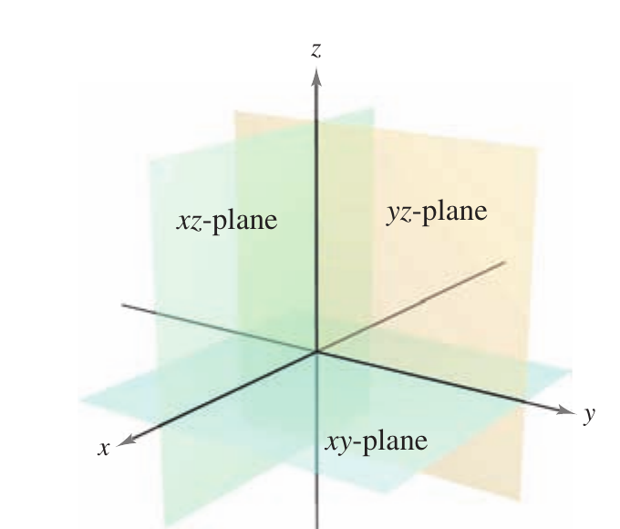
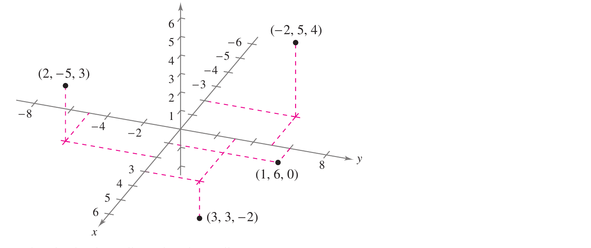
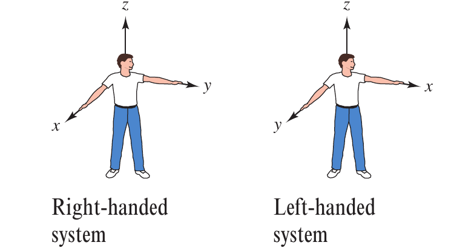
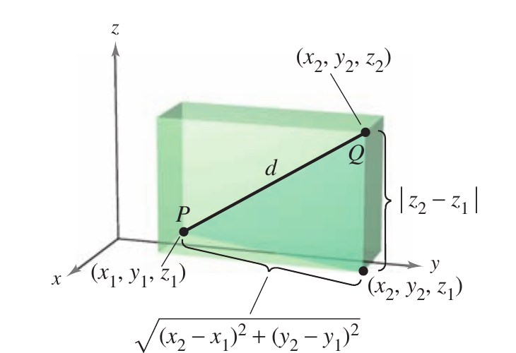
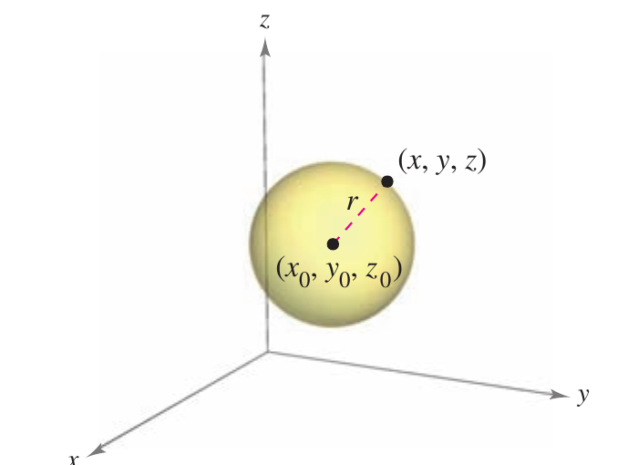
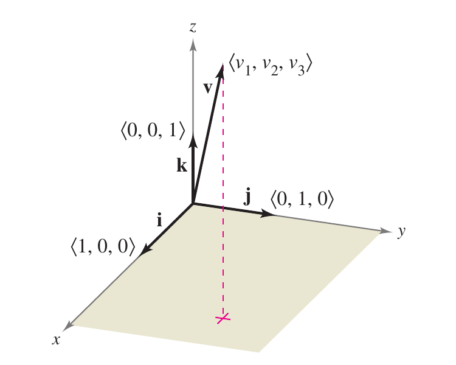
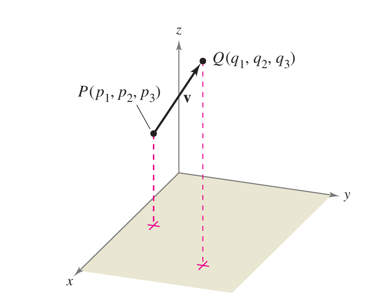
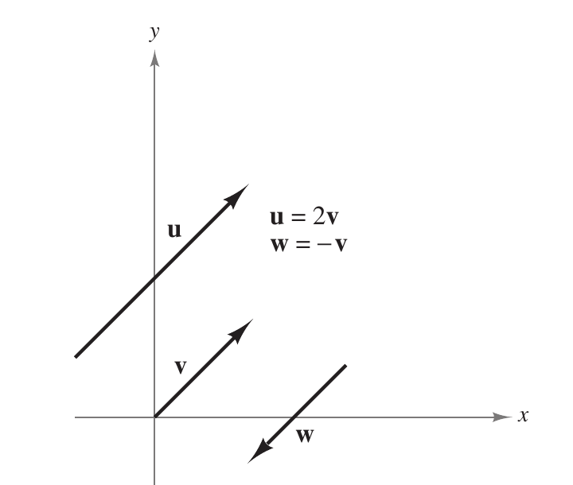
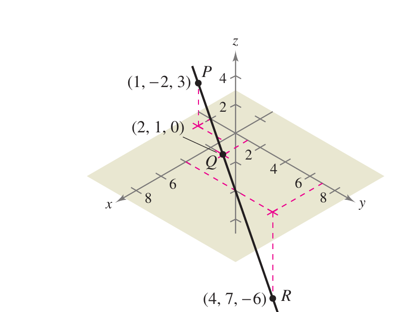
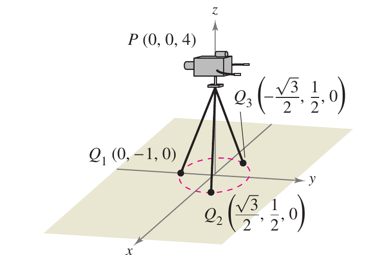

## Contexto

§11.2 estende os vetores de [§11.1](01-vetores-no-plano.qmd) do plano para o espaço
tridimensional $\mathbb{R}^3$: primeiro o sistema de coordenadas $(x,y,z)$ e as
fórmulas de distância e de esfera que dele decorrem, depois vetores
$\langle v_1,v_2,v_3\rangle$ com as mesmas operações de §11.1 — agora com uma
coordenada extra —, vetores paralelos, pontos colineares, e uma aplicação (decompor a
força que sustenta uma câmera de TV entre as três pernas de um tripé). O produto
escalar de §11.3, que dará acesso a ângulos entre vetores no espaço, ainda não é
necessário aqui.

## Ideias centrais

### Coordenadas no espaço

O sistema de coordenadas tridimensional é construído passando um eixo $z$
perpendicular aos eixos $x$ e $y$ pela origem. Tomados aos pares, os eixos determinam
três **planos coordenados** — o plano $xy$, o plano $xz$ e o plano $yz$ (Figura 11.14)
— que separam o espaço em oito **octantes**; o primeiro octante é aquele em que as
três coordenadas são positivas. Um ponto $P$ no espaço é determinado por uma tripla
ordenada $(x,y,z)$, onde

$$
x = \text{distância direcionada do plano } yz \text{ a } P, \qquad
y = \text{distância direcionada do plano } xz \text{ a } P, \qquad
z = \text{distância direcionada do plano } xy \text{ a } P.
$$

{width="42%"}



Um sistema de coordenadas tridimensional pode ter orientação **destrógira** (*right-handed*)
ou **levógira** (*left-handed*). Para determinar a orientação, imagine-se na origem,
com os braços apontando nas direções positivas de $x$ e $y$ e o eixo $z$ apontando
para cima (Figura 11.16): o sistema é destrógiro ou levógiro dependendo de qual mão
aponta ao longo do eixo $x$. Este livro trabalha exclusivamente com o sistema
destrógiro.

{width="55%"}

### Distância e a equação de uma esfera

Muitas fórmulas de $\mathbb{R}^2$ se estendem a três dimensões. Para a distância entre
dois pontos no espaço, aplica-se o Teorema de Pitágoras duas vezes (Figura 11.17): uma
vez no plano $xy$ para obter a distância horizontal
$\sqrt{(x_2-x_1)^2+(y_2-y_1)^2}$, e outra vez combinando essa distância horizontal com
a diferença vertical $|z_2-z_1|$, o que dá a

$$
d = \sqrt{(x_2-x_1)^2 + (y_2-y_1)^2 + (z_2-z_1)^2}. \qquad \text{(Fórmula da distância)}
$$

**Exemplo 1 (distância entre dois pontos no espaço).** A distância entre $(2,-1,3)$ e
$(1,0,-2)$ é
$$
d = \sqrt{(1-2)^2+(0+1)^2+(-2-3)^2} = \sqrt{1+1+25} = \sqrt{27} = 3\sqrt{3}.
$$

Uma **esfera** de centro $(x_0,y_0,z_0)$ e raio $r$ é o conjunto de todos os pontos
$(x,y,z)$ cuja distância a $(x_0,y_0,z_0)$ é $r$ (Figura 11.18), o que dá a equação
padrão
$$
(x-x_0)^2 + (y-y_0)^2 + (z-z_0)^2 = r^2. \qquad \text{(Equação da esfera)}
$$
O ponto médio do segmento entre $(x_1,y_1,z_1)$ e $(x_2,y_2,z_2)$ tem coordenadas
$$
\left(\frac{x_1+x_2}{2},\, \frac{y_1+y_2}{2},\, \frac{z_1+z_2}{2}\right). \qquad \text{(Fórmula do ponto médio)}
$$

::: {layout-ncol=2}



:::

**Exemplo 2 (equação de uma esfera).** Encontre a equação padrão da esfera que tem
$(5,-2,3)$ e $(0,4,-3)$ como extremidades de um diâmetro. Pelo ponto médio, o centro é
$$
\left(\frac{5+0}{2}, \frac{-2+4}{2}, \frac{3-3}{2}\right) = \left(\frac{5}{2}, 1, 0\right).
$$
Pela fórmula da distância, o raio é
$$
r = \sqrt{\left(0-\tfrac{5}{2}\right)^2 + (4-1)^2 + (-3-0)^2} = \sqrt{\tfrac{25}{4}+18} = \sqrt{\tfrac{97}{4}} = \frac{\sqrt{97}}{2}.
$$
Logo a equação padrão é $\left(x-\tfrac{5}{2}\right)^2 + (y-1)^2 + z^2 = \tfrac{97}{4}$.

### Vetores no espaço

No espaço, vetores são denotados por triplas ordenadas
$\mathbf{v} = \langle v_1,v_2,v_3\rangle$, o vetor nulo é
$\mathbf{0} = \langle 0,0,0\rangle$, e os vetores unitários padrão são
$\mathbf{i}=\langle1,0,0\rangle$, $\mathbf{j}=\langle0,1,0\rangle$,
$\mathbf{k}=\langle0,0,1\rangle$ na direção do eixo $z$ positivo (Figura 11.19), com
$$
\mathbf{v} = v_1\mathbf{i} + v_2\mathbf{j} + v_3\mathbf{k}.
$$
Se $\mathbf{v}$ é representado pelo segmento orientado de $P(p_1,p_2,p_3)$ a
$Q(q_1,q_2,q_3)$ (Figura 11.20), sua forma de componentes é obtida subtraindo as
coordenadas do ponto inicial das do ponto terminal:
$$
\mathbf{v} = \langle v_1,v_2,v_3\rangle = \langle q_1-p_1,\, q_2-p_2,\, q_3-p_3\rangle.
$$

::: {layout-ncol=2}



:::

> **Vetores no espaço.** Sejam $\mathbf{u}=\langle u_1,u_2,u_3\rangle$ e
> $\mathbf{v}=\langle v_1,v_2,v_3\rangle$ vetores no espaço e $c$ um escalar.
>
> 1. Igualdade: $\mathbf{u}=\mathbf{v}$ sse $u_1=v_1$, $u_2=v_2$ e $u_3=v_3$.
> 2. Forma de componentes: se $\mathbf{v}$ vai de $P(p_1,p_2,p_3)$ a $Q(q_1,q_2,q_3)$,
>    então $\mathbf{v} = \langle q_1-p_1,\, q_2-p_2,\, q_3-p_3\rangle$.
> 3. Comprimento: $\|\mathbf{v}\| = \sqrt{v_1^2+v_2^2+v_3^2}$.
> 4. Vetor unitário na direção de $\mathbf{v}$: $\dfrac{\mathbf{v}}{\|\mathbf{v}\|} = \dfrac{1}{\|\mathbf{v}\|}\langle v_1,v_2,v_3\rangle$, $\mathbf{v}\neq\mathbf{0}$.
> 5. Soma: $\mathbf{v}+\mathbf{u} = \langle v_1+u_1,\, v_2+u_2,\, v_3+u_3\rangle$.
> 6. Múltiplo escalar: $c\mathbf{v} = \langle cv_1, cv_2, cv_3\rangle$.

As propriedades de adição vetorial e multiplicação por escalar do Teorema 11.1
(§11.1) continuam válidas para vetores no espaço — a álgebra é idêntica, só com uma
coordenada a mais.

**Exemplo 3 (forma de componentes de um vetor no espaço).** Encontre a forma de
componentes e a magnitude do vetor $\mathbf{v}$ com ponto inicial $(-2,3,1)$ e
terminal $(0,-4,4)$; depois encontre um vetor unitário na direção de $\mathbf{v}$.

$$
\mathbf{v} = \langle 0-(-2),\, -4-3,\, 4-1\rangle = \langle 2,-7,3\rangle, \qquad
\|\mathbf{v}\| = \sqrt{2^2+(-7)^2+3^2} = \sqrt{62},
$$
$$
\mathbf{u} = \frac{\mathbf{v}}{\|\mathbf{v}\|} = \frac{1}{\sqrt{62}}\langle 2,-7,3\rangle = \left\langle \frac{2}{\sqrt{62}}, \frac{-7}{\sqrt{62}}, \frac{3}{\sqrt{62}} \right\rangle.
$$

### Vetores paralelos e pontos colineares

> **Definição (vetores paralelos).** Dois vetores não nulos $\mathbf{u}$ e
> $\mathbf{v}$ são **paralelos** se existe um escalar $c$ tal que
> $\mathbf{u} = c\mathbf{v}$.

Na Figura 11.21, $\mathbf{u}$, $\mathbf{v}$ e $\mathbf{w}$ são paralelos porque
$\mathbf{u}=2\mathbf{v}$ e $\mathbf{w}=-\mathbf{v}$.

{width="45%"}

**Exemplo 4 (vetores paralelos).** O vetor $\mathbf{w}$ tem ponto inicial $(2,-1,3)$ e
terminal $(-4,7,5)$, logo
$\mathbf{w} = \langle -4-2,\, 7-(-1),\, 5-3\rangle = \langle -6,8,2\rangle$. Qual dos
vetores a seguir é paralelo a $\mathbf{w}$?

a. $\mathbf{u}=\langle3,-4,-1\rangle$: como
   $\mathbf{u} = -\tfrac12\langle-6,8,2\rangle = -\tfrac12\mathbf{w}$, $\mathbf{u}$ é
   paralelo a $\mathbf{w}$.
b. $\mathbf{v}=\langle12,-16,4\rangle$: procurando $c$ tal que
   $\langle12,-16,4\rangle = c\langle-6,8,2\rangle$, obtém-se $c=-2$ (da primeira
   componente), $c=-2$ (da segunda) e $c=2$ (da terceira) — inconsistente, logo
   $\mathbf{v}$ **não** é paralelo a $\mathbf{w}$.

**Exemplo 5 (pontos colineares).** Determine se $P(1,-2,3)$, $Q(2,1,0)$ e
$R(4,7,-6)$ são colineares. Os vetores com ponto inicial comum $P$ são
$$
\overrightarrow{PQ} = \langle 2-1,\, 1-(-2),\, 0-3\rangle = \langle1,3,-3\rangle, \qquad
\overrightarrow{PR} = \langle 4-1,\, 7-(-2),\, -6-3\rangle = \langle3,9,-9\rangle.
$$
Como $\overrightarrow{PR} = 3\,\overrightarrow{PQ}$, os dois vetores são paralelos e,
tendo ponto inicial comum, $P$, $Q$ e $R$ estão sobre a mesma reta (Figura 11.22).

{width="50%"}

### Notação padrão e uma aplicação: força

**Exemplo 6 (notação de vetores unitários padrão).**

a. $\mathbf{v} = 4\mathbf{i}-5\mathbf{k} = \langle4,0,-5\rangle$ (a componente em
   $\mathbf{j}$ é $0$, pois está ausente).
b. Para $\mathbf{v}=7\mathbf{i}-\mathbf{j}+3\mathbf{k}$ com ponto inicial
   $P(-2,3,5)$, procura-se $Q(q_1,q_2,q_3)$ tal que
   $q_1-(-2)=7$, $q_2-3=-1$, $q_3-5=3$ — donde $Q=(5,2,8)$.

Vetores também representam **força**, por terem magnitude e direção; se várias
forças atuam sobre um objeto, a força resultante é a soma vetorial das forças.

**Exemplo 7 (medindo força).** Uma câmera de TV de $120$ libras é sustentada por um
tripé (Figura 11.23). As pernas tocam o chão em $Q_1(0,-1,0)$,
$Q_2\!\left(\tfrac{\sqrt3}{2},\tfrac12,0\right)$ e
$Q_3\!\left(-\tfrac{\sqrt3}{2},\tfrac12,0\right)$, com o topo em $P(0,0,4)$. As
direções das forças $\mathbf{F}_1,\mathbf{F}_2,\mathbf{F}_3$ em cada perna são
$$
\overrightarrow{PQ_1} = \langle0,-1,-4\rangle, \quad
\overrightarrow{PQ_2} = \left\langle\tfrac{\sqrt3}{2},\tfrac12,-4\right\rangle, \quad
\overrightarrow{PQ_3} = \left\langle-\tfrac{\sqrt3}{2},\tfrac12,-4\right\rangle.
$$
Como as três pernas têm o mesmo comprimento e suportam a carga igualmente,
$\|\mathbf{F}_1\|=\|\mathbf{F}_2\|=\|\mathbf{F}_3\|$, logo existe uma constante $c$
com $\mathbf{F}_1=c\langle0,-1,-4\rangle$ etc. A força total é
$\mathbf{F}=\langle0,0,-120\rangle$ e $\mathbf{F}=\mathbf{F}_1+\mathbf{F}_2+\mathbf{F}_3$
implica que cada força tem componente vertical $-40$, ou seja $c(-4)=-40$ e $c=10$.
Portanto
$$
\mathbf{F}_1 = \langle0,-10,-40\rangle, \qquad
\mathbf{F}_2 = \langle5\sqrt3,5,-40\rangle, \qquad
\mathbf{F}_3 = \langle-5\sqrt3,5,-40\rangle.
$$

{width="55%"}

## Derivações

**Fórmula da distância no espaço.** Sejam $(x_1,y_1,z_1)$ e $(x_2,y_2,z_2)$. No plano
$xy$, o ponto $(x_2,y_2,z_1)$ está à distância
$\sqrt{(x_2-x_1)^2+(y_2-y_1)^2}$ de $(x_1,y_1,z_1)$ pelo Teorema de Pitágoras em
duas dimensões. O segmento de $(x_1,y_1,z_1)$ a $(x_2,y_2,z_2)$ é a hipotenusa de um
segundo triângulo retângulo, cujos catetos são esse valor e $|z_2-z_1|$ (o cateto
vertical, perpendicular ao plano $xy$). Aplicando o Teorema de Pitágoras outra vez,
$$
d^2 = \left(\sqrt{(x_2-x_1)^2+(y_2-y_1)^2}\right)^2 + (z_2-z_1)^2 = (x_2-x_1)^2+(y_2-y_1)^2+(z_2-z_1)^2,
$$
donde a fórmula da distância. A equação da esfera segue diretamente: $(x,y,z)$ está
na esfera de centro $(x_0,y_0,z_0)$ e raio $r$ exatamente quando sua distância ao
centro é $r$, isto é, quando $d^2=r^2$ na fórmula acima com $(x_1,y_1,z_1)=(x_0,y_0,z_0)$.

**Consistência do Exemplo 7.** As três pernas têm o mesmo comprimento
$\|\overrightarrow{PQ_i}\| = \sqrt{(\pm\sqrt3/2)^2+(1/2)^2+16} = \sqrt{3/4+1/4+16}=\sqrt{17}$
(a mesma para $i=1,2,3$, confirmando $\|\mathbf{F}_1\|=\|\mathbf{F}_2\|=\|\mathbf{F}_3\|$
independentemente de $c$). Somando as três forças encontradas,
$$
\mathbf{F}_1+\mathbf{F}_2+\mathbf{F}_3 = \langle 0+5\sqrt3-5\sqrt3,\; -10+5+5,\; -40-40-40\rangle = \langle0,0,-120\rangle = \mathbf{F},
$$
confirmando a solução.

## Implementação

```{python}
import numpy as np
import matplotlib.pyplot as plt

# Exemplo 7 — tripé: verifica F1+F2+F3 = (0,0,-120) e plota as pernas em 3D
P = np.array([0, 0, 4])
Q1 = np.array([0, -1, 0])
Q2 = np.array([np.sqrt(3) / 2, 0.5, 0])
Q3 = np.array([-np.sqrt(3) / 2, 0.5, 0])

c = 10
F1 = c * (Q1 - P)
F2 = c * (Q2 - P)
F3 = c * (Q3 - P)
F_total = F1 + F2 + F3

print(f"F1 = {F1}, F2 = {F2}, F3 = {F3}")
print(f"F1 + F2 + F3 = {F_total} (esperado: [0, 0, -120])")

fig = plt.figure(figsize=(6, 6))
ax = fig.add_subplot(projection="3d")

for Q, label in [(Q1, "$Q_1$"), (Q2, "$Q_2$"), (Q3, "$Q_3$")]:
    ax.plot([P[0], Q[0]], [P[1], Q[1]], [P[2], Q[2]], color="k", linewidth=2)
    ax.scatter(*Q, color="k")
    ax.text(*Q, label)

ax.scatter(*P, color="C3", s=40)
ax.text(*P, "  $P$", color="C3")

theta = np.linspace(0, 2 * np.pi, 100)
ax.plot(0.9 * np.cos(theta), 0.9 * np.sin(theta), np.zeros_like(theta), "--", color="gray", linewidth=0.8)

ax.set_xlabel("$x$")
ax.set_ylabel("$y$")
ax.set_zlabel("$z$")
ax.set_title("Exemplo 7 — tripé da câmera")
plt.tight_layout()
plt.show()
```

O resultado numérico confirma $\mathbf{F}_1+\mathbf{F}_2+\mathbf{F}_3=\langle0,0,-120\rangle$,
igual à força total exercida pela câmera.

## Conexões

As seis propriedades de vetores no espaço são a extensão literal do Teorema 11.1 de
[§11.1](01-vetores-no-plano.qmd) para $\mathbb{R}^3$ — a mesma estrutura de espaço
vetorial, com uma coordenada a mais. O produto escalar de §11.3 vai fornecer o
ângulo entre vetores no espaço (por exemplo, o ângulo entre as pernas do tripé do
Exemplo 7), e §11.5 (retas e planos no espaço) vai reusar diretamente a forma de
componentes e os pontos colineares desta nota. Essas notas ainda não foram escritas
neste repositório.


## Referências

[@larson2010multivariablecalculus], capítulo 11, §11.2.
