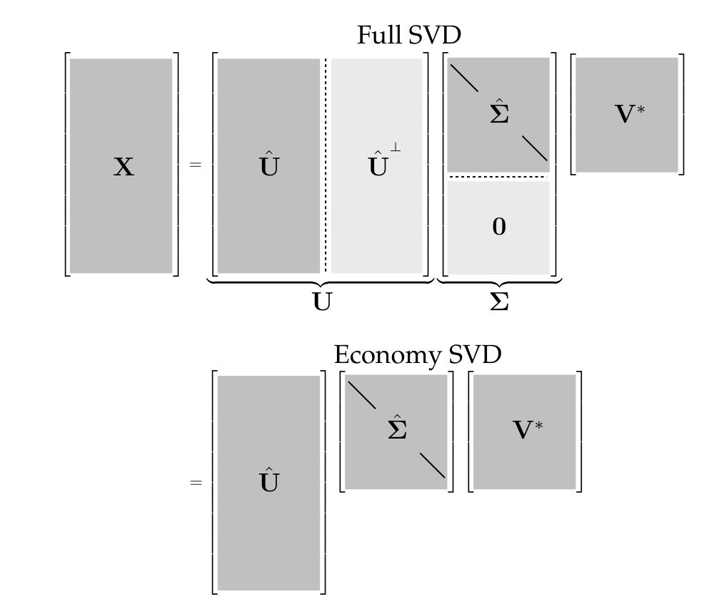
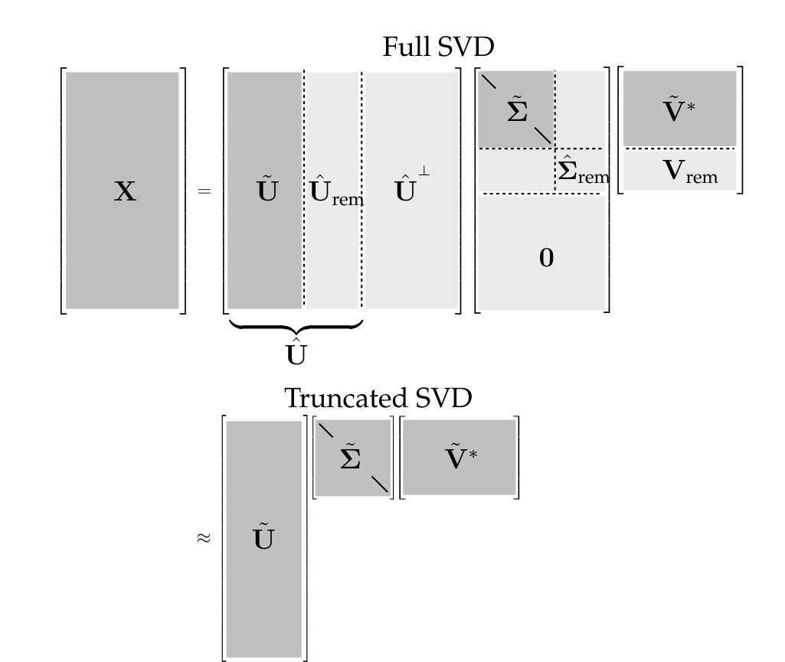

## Dados de alta dimensão, padrões de baixa dimensão

- Sistemas complexos geram dados naturalmente organizados em **matrizes grandes**: séries temporais de experimentos e simulações, imagens, vídeos, registros neurais, campos de velocidade de escoamentos.
- Apesar da dimensão elevada, esses dados costumam ter **posto baixo**: poucos padrões dominantes explicam a maior parte da informação (imagens são compressíveis; escoamentos turbulentos têm estruturas coerentes).
- A **decomposição em valores singulares** (SVD) extrai esses padrões diretamente dos dados, sem conhecimento especialista: é numericamente estável, fornece uma representação **hierárquica** e **existe para qualquer matriz** (ao contrário da autodecomposição).
- Pode ser vista como uma generalização *orientada a dados* da FFT: a FFT fornece uma base genérica; a SVD, uma base **ajustada aos dados**.
- Usos ao longo do livro: aproximações de posto baixo, pseudoinversa para $\mathbf{A}\mathbf{x} = \mathbf{b}$, redução de ruído, PCA, DMD, POD.

## A matriz de dados

Os dados são organizados em uma matriz cujas colunas são medições:

$$
\mathbf{X} = \begin{bmatrix} | & | & & | \\ \mathbf{x}_1 & \mathbf{x}_2 & \cdots & \mathbf{x}_m \\ | & | & & | \end{bmatrix} \in \mathbb{C}^{n \times m}.
\qquad (1.1)
$$

- Cada coluna $\mathbf{x}_k \in \mathbb{C}^n$ é um conjunto de medições: uma imagem reorganizada em vetor (um elemento por pixel), o estado de um sistema físico em um instante etc.
- Em séries temporais, $\mathbf{x}_k = \mathbf{x}(k\Delta t)$; as colunas são chamadas de ***snapshots*** e $m$ é o número de *snapshots*.
- A dimensão de estado $n$ costuma ser enorme (milhões ou bilhões de graus de liberdade): em geral $n \gg m$, uma matriz **alta e estreita** (*tall-skinny*).

## Definição da SVD

::: {.callout-note title="Definição"}
Toda matriz $\mathbf{X} \in \mathbb{C}^{n \times m}$ admite a decomposição
$$
\mathbf{X} = \mathbf{U} \boldsymbol{\Sigma} \mathbf{V}^*, \qquad (1.2)
$$
em que $\mathbf{U} \in \mathbb{C}^{n \times n}$ e $\mathbf{V} \in \mathbb{C}^{m \times m}$ são **unitárias** ($\mathbf{U}\mathbf{U}^* = \mathbf{U}^*\mathbf{U} = \mathbf{I}$), e $\boldsymbol{\Sigma} \in \mathbb{R}^{n \times m}$ tem entradas reais não negativas na diagonal e zeros fora dela. $^*$ denota o transposto conjugado ($\mathbf{X}^* = \mathbf{X}^T$ para matrizes reais).
:::

- As colunas de $\mathbf{U}$ são os **vetores singulares à esquerda** de $\mathbf{X}$; as de $\mathbf{V}$, os **vetores singulares à direita**.
- Os elementos diagonais de $\boldsymbol{\Sigma}$ são os **valores singulares**, ordenados do maior para o menor: $\sigma_1 \ge \sigma_2 \ge \cdots \ge 0$.
- O **posto** de $\mathbf{X}$ é igual ao número de valores singulares não nulos.

## SVD completa e SVD econômica

:::: {.columns}
::: {.column width="48%"}
Quando $n \ge m$, $\boldsymbol{\Sigma}$ tem no máximo $m$ elementos não nulos na diagonal:
$$
\boldsymbol{\Sigma} = \begin{bmatrix} \hat{\boldsymbol{\Sigma}} \\ \mathbf{0} \end{bmatrix}.
$$

Logo, $\mathbf{X}$ é representada **exatamente** pela SVD econômica:
$$
\mathbf{X} = \mathbf{U}\boldsymbol{\Sigma}\mathbf{V}^* = \begin{bmatrix} \hat{\mathbf{U}} & \hat{\mathbf{U}}^{\perp} \end{bmatrix} \begin{bmatrix} \hat{\boldsymbol{\Sigma}} \\ \mathbf{0} \end{bmatrix} \mathbf{V}^* = \hat{\mathbf{U}} \hat{\boldsymbol{\Sigma}} \mathbf{V}^*. \quad (1.3)
$$

As colunas de $\hat{\mathbf{U}}^{\perp}$ geram o complemento ortogonal do espaço gerado por $\hat{\mathbf{U}}$; elas multiplicam o bloco nulo e podem ser descartadas.
:::
::: {.column width="52%"}
{width="100%"}
:::
::::

## Computando a SVD

- Na prática, usamos implementações maduras e estáveis; o algoritmo clássico tem duas etapas:
  1. reduzir $\mathbf{X}$ a uma matriz **bidiagonal** (para $n \gg m$, primeiro uma fatoração QR e depois reflexões de Householder);
  2. calcular a SVD da matriz bidiagonal com o algoritmo QR modificado de **Golub & Kahan**.
- A maioria das implementações se apoia no LAPACK (rotina `DGESVD`); para matrizes muito grandes, algoritmos **randomizados** (§1.8).

```{python}
#| echo: true
import numpy as np

X = np.random.rand(5, 3)                                   # matriz de dados 5 x 3
U, S, VT = np.linalg.svd(X, full_matrices=True)            # SVD completa
Uhat, Shat, VThat = np.linalg.svd(X, full_matrices=False)  # SVD econômica
print("completa:  U", U.shape, " S", S.shape, " VT", VT.shape)
print("econômica: U", Uhat.shape, " S", Shat.shape, " VT", VThat.shape)
```

Atenção: o NumPy devolve os valores singulares como **vetor** e $\mathbf{V}^T$ (não $\mathbf{V}$).

## Onde a SVD aparece

- **Histórico**: fundamentos teóricos com Beltrami e Jordan (1873), Sylvester (1889), Schmidt (1907) e Weyl (1912); estabilidade e eficiência computacional com Golub e colaboradores.
- É a base de várias técnicas de **redução de dimensionalidade**, desenvolvidas de forma independente em áreas diferentes e que diferem, em muitos casos, apenas na coleta e no pré-processamento dos dados:
  - análise de componentes principais (**PCA**), em estatística;
  - transformada de Karhunen–Loève (**KLT**);
  - funções ortogonais empíricas (**EOFs**), em climatologia;
  - decomposição ortogonal própria (**POD**), em dinâmica dos fluidos;
  - análise de correlação canônica (**CCA**).
- Em **identificação de sistemas e controle**, é usada para obter modelos de ordem reduzida **balanceados**: estados ordenados pela capacidade de serem observados pelas medições e controlados pela atuação.

## Soma diádica

A propriedade mais útil da SVD: ela fornece uma **hierarquia de aproximações de posto baixo**. Como $\boldsymbol{\Sigma}$ é diagonal, $\mathbf{X}$ é uma soma de matrizes de posto 1:

$$
\mathbf{X} = \sum_{k=1}^{m} \sigma_k \mathbf{u}_k \mathbf{v}_k^* = \sigma_1 \mathbf{u}_1 \mathbf{v}_1^* + \sigma_2 \mathbf{u}_2 \mathbf{v}_2^* + \cdots + \sigma_m \mathbf{u}_m \mathbf{v}_m^*, \qquad (1.4)
$$

com $\mathbf{u}_k$ e $\mathbf{v}_k$ as $k$-ésimas colunas de $\mathbf{U}$ e $\mathbf{V}$.

- Como $\sigma_1 \ge \sigma_2 \ge \cdots \ge \sigma_m \ge 0$, cada termo $\sigma_k \mathbf{u}_k \mathbf{v}_k^*$ é **menos importante** que o anterior para capturar a informação de $\mathbf{X}$.
- Em muitos sistemas os $\sigma_k$ decaem rapidamente, e basta **truncar** a soma em um posto $r$.

## SVD truncada

:::: {.columns}
::: {.column width="50%"}
$$
\mathbf{X} \approx \tilde{\mathbf{X}} = \sum_{k=1}^{r} \sigma_k \mathbf{u}_k \mathbf{v}_k^* = \tilde{\mathbf{U}} \tilde{\boldsymbol{\Sigma}} \tilde{\mathbf{V}}^*. \qquad (1.5)
$$

- $\tilde{\mathbf{U}}$ e $\tilde{\mathbf{V}}$: as $r$ primeiras colunas de $\mathbf{U}$ e $\mathbf{V}$; $\tilde{\boldsymbol{\Sigma}}$: o bloco $r \times r$ inicial de $\boldsymbol{\Sigma}$.
- Se $r$ for menor que o posto de $\mathbf{X}$, a SVD truncada apenas **aproxima** $\mathbf{X}$ (se $\mathbf{X}$ não tem posto completo, ela pode ser exata).
- $\tilde{\mathbf{U}}$ é uma **mudança de coordenadas** do espaço de medições (alta dimensão) para um espaço de padrões (baixa dimensão).
- A escolha de $r$ é discutida na §1.7.
:::
::: {.column width="50%"}
{width="100%"}
:::
::::

## Teorema de Eckart–Young

Schmidt (o de Gram–Schmidt) generalizou a SVD para espaços de funções e estabeleceu a SVD truncada como aproximação ótima de posto baixo; o resultado foi redescoberto por Eckart e Young.

::: {.callout-note title="Teorema 1.1 (Eckart–Young)"}
A melhor aproximação de posto $r$ de $\mathbf{X}$, no sentido de mínimos quadrados, é a SVD truncada de posto $r$:
$$
\underset{\tilde{\mathbf{X}},\ \text{s.a.}\ \operatorname{posto}(\tilde{\mathbf{X}}) = r}{\operatorname{argmin}} \ \big\| \mathbf{X} - \tilde{\mathbf{X}} \big\|_F = \tilde{\mathbf{U}} \tilde{\boldsymbol{\Sigma}} \tilde{\mathbf{V}}^*. \qquad (1.6)
$$
:::

A norma de Frobenius é a norma 2 da matriz "vetorizada", $\mathbf{X}(:)$:
$$
\|\mathbf{X}\|_F = \sqrt{\sum_{i=1}^{n} \sum_{j=1}^{m} |X_{ij}|^2}.
$$

## Erro da aproximação na norma de Frobenius

O erro da SVD truncada de posto $r$ é conhecido exatamente, e **nenhuma outra matriz de posto $r$ erra menos**:

$$
\big\| \mathbf{X} - \tilde{\mathbf{X}} \big\|_F^2 = \sum_{k=r+1}^{m} \sigma_k^2. \qquad (1.7)
$$

Como esse erro escala com o tamanho e a magnitude de $\mathbf{X}$, costuma ser mais útil o **erro relativo**:

$$
\frac{\big\| \mathbf{X} - \tilde{\mathbf{X}} \big\|_F^2}{\|\mathbf{X}\|_F^2}. \qquad (1.8)
$$

- Se as colunas de $\mathbf{X}$ são campos de velocidade de um escoamento, (1.8) é a fração da **energia cinética** que falta na aproximação.
- Para dados com média subtraída, é a fração da **variância** que falta (interpretação estatística explorada na §1.5, PCA).

## Aproximação ótima na norma 2

A SVD truncada também é ótima na **norma 2** (norma espectral), induzida pela norma 2 de vetores:

$$
\underset{\tilde{\mathbf{X}},\ \text{s.a.}\ \operatorname{posto}(\tilde{\mathbf{X}}) = r}{\operatorname{argmin}} \ \big\| \mathbf{X} - \tilde{\mathbf{X}} \big\|_2 = \tilde{\mathbf{U}} \tilde{\boldsymbol{\Sigma}} \tilde{\mathbf{V}}^*, \qquad (1.9)
\qquad
\|\mathbf{X}\|_2 = \max_{\mathbf{v} \neq \mathbf{0}} \frac{\|\mathbf{X}\mathbf{v}\|_2}{\|\mathbf{v}\|_2}.
$$

Nessa norma, o erro é ainda mais simples:
$$
\big\| \mathbf{X} - \tilde{\mathbf{X}} \big\|_2 = \sigma_{r+1}. \qquad (1.10)
$$

Basta expandir o resíduo,
$$
\mathbf{X} - \tilde{\mathbf{X}} = \sum_{k=r+1}^{m} \sigma_k \mathbf{u}_k \mathbf{v}_k^*, \qquad (1.11)
$$
e usar a ortonormalidade dos $\mathbf{v}_k$: o máximo de $\|(\mathbf{X} - \tilde{\mathbf{X}})\mathbf{v}\|_2$ sobre vetores unitários é $\sigma_{r+1}$, atingido em $\mathbf{v} = \mathbf{v}_{r+1}$.

## Verificação numérica das expressões de erro

```{python}
#| echo: true
rng = np.random.default_rng(0)
X = rng.standard_normal((200, 50))
U, S, VT = np.linalg.svd(X, full_matrices=False)

r = 10
Xr = U[:, :r] @ np.diag(S[:r]) @ VT[:r, :]         # SVD truncada de posto r (1.5)

print(f"||X - Xr||_F^2 = {np.linalg.norm(X - Xr, 'fro')**2:10.4f}   soma sigma_k^2 (k > r) = {np.sum(S[r:]**2):10.4f}   (1.7)")
print(f"||X - Xr||_2   = {np.linalg.norm(X - Xr, 2):10.4f}   sigma_(r+1)             = {S[r]:10.4f}   (1.10)")
```

Os índices em Python começam em 0: `S[r]` é $\sigma_{r+1}$ e `S[r:]` são $\sigma_{r+1}, \dots, \sigma_m$.

## Exemplo: compressão de imagem

Uma imagem em tons de cinza é uma matriz real $\mathbf{X} \in \mathbb{R}^{n \times m}$ ($n$ pixels na vertical, $m$ na horizontal). O livro usa uma foto de $2000 \times 1500$ pixels; aqui, a foto de Grace Hopper que acompanha o matplotlib ($600 \times 512$).

```{python}
#| echo: true
import matplotlib.pyplot as plt
from matplotlib import cbook

A = plt.imread(cbook.get_sample_data("grace_hopper.jpg", asfileobj=False))
X = np.mean(A, axis=-1)                                 # RGB -> tons de cinza
n, m = X.shape
U, S, VT = np.linalg.svd(X, full_matrices=False)        # SVD econômica

def aproxima(r):
    """SVD truncada de posto r (1.5)."""
    return U[:, :r] @ np.diag(S[:r]) @ VT[:r, :]

def armazenamento(r):
    """Fração de números guardados: r colunas de U e de V e r valores singulares."""
    return r * (n + m + 1) / (n * m)
```

Guardar $\tilde{\mathbf{U}}$, $\tilde{\boldsymbol{\Sigma}}$ e $\tilde{\mathbf{V}}$ exige $r(n + m + 1)$ números, contra $nm$ da imagem original: a truncação é uma **compressão**.

## Imagem reconstruída para vários postos $r$

```{python}
#| fig-align: center
fig, axs = plt.subplots(1, 4, figsize=(16, 5.2))
axs[0].imshow(X, cmap="gray")
axs[0].set_title("Original")
for ax, r in zip(axs[1:], [5, 20, 100]):
    ax.imshow(aproxima(r), cmap="gray")
    ax.set_title(f"r = {r}, {100 * armazenamento(r):.2f}% de armazenamento")
for ax in axs:
    ax.axis("off")
plt.tight_layout()
plt.show()
```

Com $r = 5$ só se reconhecem as grandes regiões claras e escuras; com $r = 100$ a imagem já é visualmente próxima da original.

## Valores singulares e erro de truncamento

```{python}
#| fig-align: center
ranks = [5, 20, 100]
fig, (ax1, ax2) = plt.subplots(1, 2, figsize=(14, 4.2))
ax1.semilogy(S, "k")
ax1.set_xlabel("$k$"); ax1.set_ylabel(r"$\sigma_k$")
ax2.plot(np.cumsum(S) / np.sum(S), "k")
ax2.set_xlabel("$k$"); ax2.set_ylabel("soma acumulada normalizada")
for r in ranks:
    for ax, y in ((ax1, S[r - 1]), (ax2, np.sum(S[:r]) / np.sum(S))):
        ax.plot(r - 1, y, "o", ms=8)
plt.tight_layout()
plt.show()

erro = lambda r: np.sum(S[r:]**2) / np.sum(S**2)       # erro relativo (1.8), via (1.7)
for r in ranks:
    print(f"r = {r:3d}:  soma acumulada = {np.sum(S[:r]) / np.sum(S):5.1%}   "
          f"erro relativo ||X - X~||_F^2 / ||X||_F^2 = {erro(r):6.2%}")
```
