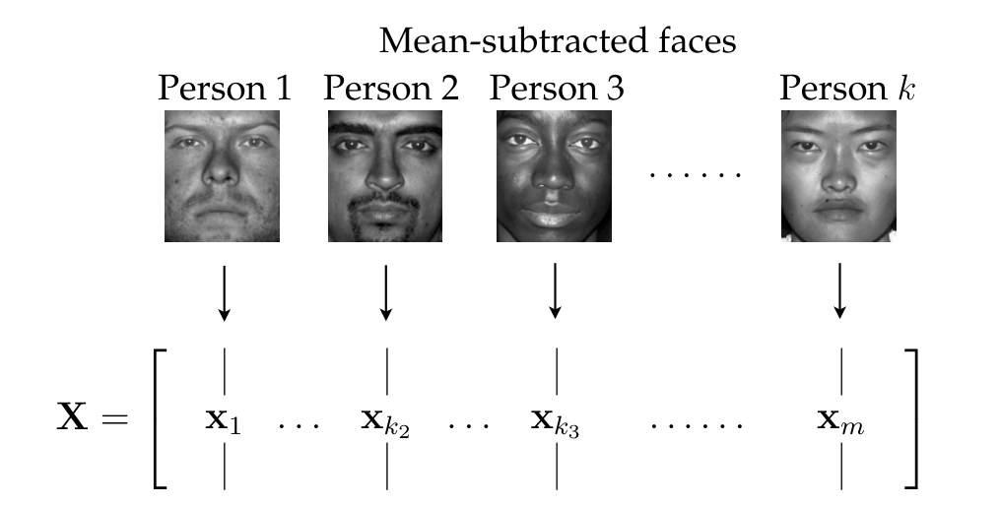
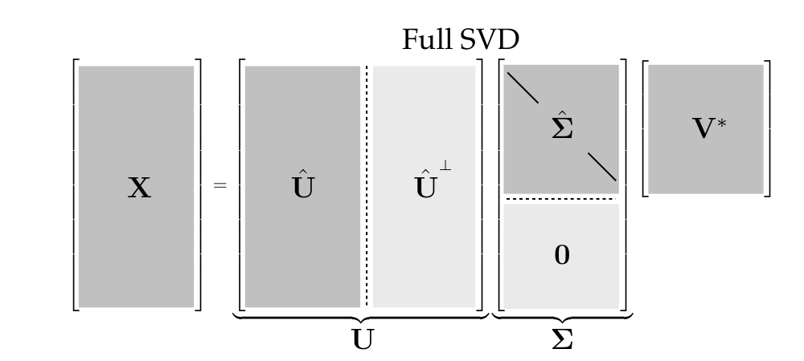
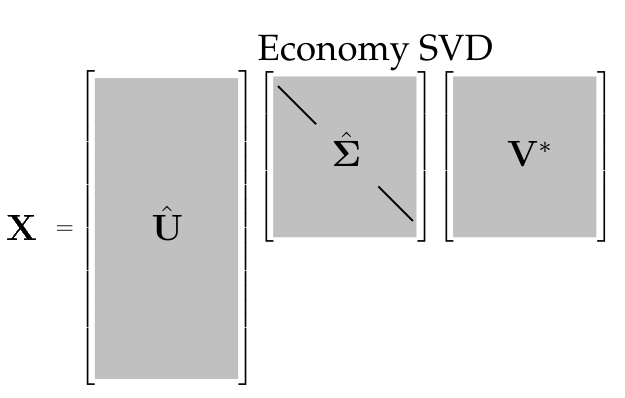

## Muitos dados - Poucos padrões {.small-slide .nostretch}

:::: {.columns}
::: {.column width="60%"}
### Sistemas Complexos:

- Muitos dados: séries temporais, imagens;
- Poucos padrões (posto) dominantes: modos, polos, frequências;

```{python}
#| echo: false
import numpy as np
import matplotlib.pyplot as plt
plt.rcParams.update({"font.size": 14})

rng = np.random.default_rng(3)
fs, N = 1000, 1000                                  # 1 kHz, 1 s
t = np.arange(N) / fs
x = (1.0 * np.sin(2*np.pi*50*t) + 0.7 * np.sin(2*np.pi*120*t)
     + 0.5 * np.sin(2*np.pi*300*t) + 1.5 * rng.standard_normal(N))
Xf = np.abs(np.fft.rfft(x)) * 2 / N
f = np.fft.rfftfreq(N, 1 / fs)

fig, (a1, a2) = plt.subplots(1, 2, figsize=(8, 3.4))
a1.plot(1000 * t[:200], x[:200], color="tab:blue", lw=1)
a1.set_xlabel("$t$ [ms]"); a1.set_title("sinal amostrado $x[k]$")
a2.plot(f, Xf, color="k", lw=1)
a2.set_xlabel("$f$ [Hz]"); a2.set_title("espectro $|X(f)|$")
for f0 in (50, 120, 300):
    a2.annotate(f"{f0} Hz", xy=(f0, Xf[f0]), xytext=(f0 + 25, Xf[f0] + 0.08),
                color="tab:orange", fontsize=13)
a2.set_ylim(0, 1.25)
plt.tight_layout()
plt.show()
```
:::
::: {.column width="40%"}
{width="350px" fig-align="center"}
:::
::::

## Ex: identificação de sistemas {.nostretch .small-slide}

```{python}
#| echo: false
#| fig-align: center
import numpy as np
import matplotlib.pyplot as plt
from matplotlib.patches import FancyBboxPatch, FancyArrowPatch, Circle
from scipy import signal

plt.rcParams.update({"font.size": 13})
rng = np.random.default_rng(1)


def prbs7(N):
    """PRBS de 7 bits (LFSR, período 127), valores ±1."""
    reg, out = [1] * 7, []
    for _ in range(N):
        out.append(reg[-1])
        reg = [reg[-1] ^ reg[-2]] + reg[:-1]
    return 2.0 * np.array(out) - 1.0


# Sistema LIT "desconhecido": G(z) = (0.10 z + 0.08) / (z^2 - 1.6 z + 0.8)
N = 500
u = prbs7(N)
b_real, a_real = [0, 0.10, 0.08], [1, -1.6, 0.8]
y = signal.lfilter(b_real, a_real, u) + 0.01 * rng.standard_normal(N)

# 1) resposta ao impulso por mínimos quadrados (modelo FIR de 60 coeficientes)
M = 60
Phi = np.column_stack([np.r_[np.zeros(i), u[:N - i]] for i in range(M)])
h = np.linalg.lstsq(Phi, y, rcond=None)[0]

# 2) matriz de Hankel e SVD  3) realização de ordem r (Ho–Kalman / ERA)
L = 25
H0 = np.array([[h[i + j + 1] for j in range(L)] for i in range(L)])
H1 = np.array([[h[i + j + 2] for j in range(L)] for i in range(L)])
U, S, VT = np.linalg.svd(H0)
r = 2
Sm, Sp = np.diag(S[:r] ** -0.5), np.diag(S[:r] ** 0.5)
A = Sm @ U[:, :r].T @ H1 @ VT[:r].T @ Sm
B = (Sp @ VT[:r])[:, :1]
C = (U[:, :r] @ Sp)[:1, :]
num, den = signal.ss2tf(A, B, C, np.zeros((1, 1)))
polos = np.linalg.eigvals(A)

# ---------------------------------------------------------------- figura
fig = plt.figure(figsize=(14, 6.9))
gs = fig.add_gridspec(2, 3, height_ratios=[1, 1.25], width_ratios=[1.25, 0.8, 1.25],
                      hspace=0.55, wspace=0.28)

k = np.arange(150)
ax_u = fig.add_subplot(gs[0, 0])
ax_u.step(k, u[:150], where="post", color="tab:blue", lw=1.4)
ax_u.set_title(f"entrada $u[k]$: PRBS ({N} amostras)")
ax_u.set_xlabel("$k$"); ax_u.set_ylim(-1.5, 1.5)

ax_g = fig.add_subplot(gs[0, 1]); ax_g.axis("off")
ax_g.add_patch(FancyBboxPatch((0.12, 0.25), 0.76, 0.5, boxstyle="round,pad=0.02",
                              fc="#E8EEF7", ec="#1B365D", lw=2, transform=ax_g.transAxes))
ax_g.text(0.5, 0.5, "sistema LIT\n$G(z)$ = ?", ha="center", va="center", fontsize=17,
          color="#1B365D", transform=ax_g.transAxes)

ax_y = fig.add_subplot(gs[0, 2])
ax_y.plot(k, y[:150], color="tab:red", lw=1.4)
ax_y.set_title(f"saída $y[k]$ ({N} amostras)")
ax_y.set_xlabel("$k$")

pu, pg, py = ax_u.get_position(), ax_g.get_position(), ax_y.get_position()
ym = pu.y0 + pu.height / 2
for x0, x1 in ((pu.x1 + 0.008, pg.x0 + 0.12 * pg.width - 0.006),
               (pg.x0 + 0.88 * pg.width + 0.006, py.x0 - 0.045)):
    fig.add_artist(FancyArrowPatch((x0, ym), (x1, ym), transform=fig.transFigure,
                                   arrowstyle="-|>", mutation_scale=28, lw=2.5, color="#1B365D"))

ax_s = fig.add_subplot(gs[1, 0])
ax_s.semilogy(np.arange(1, 11), S[:10], "o-", color="k", ms=6)
ax_s.semilogy([1, 2], S[:2], "o", color="tab:orange", ms=11)
ax_s.set_xlabel("$k$"); ax_s.set_ylabel("$\\sigma_k$"); ax_s.set_xticks([1, 2, 4, 6, 8, 10])
ax_s.annotate("2 padrões\ndominantes", xy=(2, S[1]), xytext=(4.2, 0.12),
              arrowprops=dict(arrowstyle="->", color="tab:orange", lw=2), color="tab:orange")

ax_tf = fig.add_subplot(gs[1, 1]); ax_tf.axis("off")
ax_tf.text(0.5, 0.5,
          "$\\hat G(z) = \\dfrac{%.3f\\,z + %.3f}{z^2 %+.3f\\,z %+.3f}$"
          % (num[0][1], num[0][2], den[1], den[2]),
          transform=ax_tf.transAxes, ha="center", va="center", fontsize=17)

ax_p = fig.add_subplot(gs[1, 2])
ax_p.add_patch(Circle((0, 0), 1, fill=False, ls="--", color="gray"))
ax_p.plot(polos.real, polos.imag, "x", ms=14, mew=3, color="tab:orange")
ax_p.set_aspect("equal"); ax_p.set_xlim(-1.2, 1.2); ax_p.set_ylim(-1.2, 1.2)
ax_p.axhline(0, color="gray", lw=0.6); ax_p.axvline(0, color="gray", lw=0.6)
ax_p.set_title("2 polos: $z = %.2f \\pm %.2fj$" % (polos[0].real, abs(polos[0].imag)))
ax_p.set_xlabel("Re"); ax_p.set_ylabel("Im")

plt.show()
```

Centenas de amostras, mas apenas **dois padrões dominantes**: os padrões são os seus **dois polos**.

## A matriz de dados {.small-slide .nostretch}

Cada coluna de $\mathbf{X} = [\mathbf{x}_1 \ \cdots \ \mathbf{x}_m] \in \mathbb{C}^{n \times m}$ é um conjunto de medições: uma imagem, ou amostras de entrada e saída de um sistema.

:::: {.columns}
::: {.column width="55%"}

{width="100%"}

:::
::: {.column width="45%"}

```{python}
#| echo: false
import numpy as np
import matplotlib.pyplot as plt
from scipy import signal

plt.rcParams.update({"mathtext.fontset": "cm", "font.family": "serif", "font.size": 20})
rng = np.random.default_rng(2)
N = 40
u = np.sign(rng.standard_normal(N))                  # entrada binária
y = signal.lfilter([0, 0.10, 0.08], [1, -1.6, 0.8], u)

# colunas: y[k-1], y[k-2], u[k-1], u[k-2]  (linhas: k = 3, ..., N)
cols = [("y", 1, "tab:red"), ("y", 2, "tab:red"), ("u", 1, "tab:blue"), ("u", 2, "tab:blue")]
xs = [2.7, 4.6, 6.5, 8.4]
fig, ax = plt.subplots(figsize=(7.4, 6.0))
ax.set_xlim(0, 10.2); ax.set_ylim(-0.2, 9.3); ax.axis("off")

k = np.arange(3, N + 1)
for x, (sinal, atraso, cor) in zip(xs, cols):
    sig = (y if sinal == "y" else u)[k - 1 - atraso]
    ins = ax.inset_axes([x - 0.8, 6.9, 1.6, 1.4], transform=ax.transData)
    (ins.step if sinal == "u" else ins.plot)(k, sig, color=cor, lw=1.2)
    ins.set_xticks([]); ins.set_yticks([])
    ins.set_title(f"${sinal}[k-{atraso}]$", fontsize=18, pad=4)
    ax.annotate("", xy=(x, 5.55), xytext=(x, 6.6),
                arrowprops=dict(arrowstyle="-|>", color="k", lw=1.2))
    # entradas simbólicas da coluna
    for yy, kk in zip([4.7, 3.8, 2.75, 1.8], ["3", "4", None, "N"]):
        if kk is None:
            txt = r"$\vdots$"
        elif kk.isdigit():
            txt = f"${sinal}[{int(kk) - atraso}]$"
        else:
            txt = f"${sinal}[{kk}-{atraso}]$"
        ax.text(x, yy, txt, ha="center", va="center", fontsize=18)
    ax.text(x, 0.55, f"$\\mathbf{{x}}_{cols.index((sinal, atraso, cor)) + 1}$", ha="center", va="center")
    ax.plot([x, x], [1.05, 1.3], "k", lw=1)
for x0, s in ((1.55, 1), (9.55, -1)):                              # colchetes
    ax.plot([x0 + 0.15 * s, x0, x0, x0 + 0.15 * s], [5.25, 5.25, 1.3, 1.3], "k", lw=1.6)
ax.text(1.25, 3.3, r"$\mathbf{X} =$", ha="right", va="center")
plt.show()
plt.rcdefaults()                      # volta à fonte padrão nas próximas figuras
```

:::
::::

- As colunas são ***snapshots*** $\mathbf{x}_k = \mathbf{x}(k\Delta t)$; em geral $n \gg m$: uma matriz **alta e estreita**.

## Uma matriz como soma de padrões {.nostretch .small-slide}

```{python}
#| echo: false
#| fig-align: center
import numpy as np
import matplotlib.pyplot as plt

plt.rcParams.update({"font.size": 15})
# Bandeira da Noruega: campo vermelho, cruz branca com cruz azul dentro;
# proporções 6:1:2:1:12 (largura, 22) e 6:1:2:1:6 (altura, 16)
e = 8                                                         # pixels por unidade
n, m = 16 * e, 22 * e
i, j = np.mgrid[0:n, 0:m]
branca = ((i >= 6 * e) & (i < 10 * e)) | ((j >= 6 * e) & (j < 10 * e))
azul_ = ((i >= 7 * e) & (i < 9 * e)) | ((j >= 7 * e) & (j < 9 * e))
vermelho, branco, azul = (np.array(c) / 255 for c in ([0xBA, 0x0C, 0x2F], [255, 255, 255], [0x00, 0x20, 0x5B]))
X = np.where(azul_[..., None], azul, np.where(branca[..., None], branco, vermelho))

Y = np.hstack([X[:, :, c] for c in range(3)])                 # canais lado a lado: n x 3m
U, S, VT = np.linalg.svd(Y, full_matrices=False)
r = int(np.sum(S > 1e-10 * S[0]))                             # posto (3)
cor = lambda M: M.reshape(n, 3, m).transpose(0, 2, 1)         # n x 3m -> imagem n x m x 3
vis = lambda P: np.clip(0.5 + P / (2 * np.abs(P).max()), 0, 1) # visualização de termo com sinal

fig = plt.figure(figsize=(16, 6.0))
gs = fig.add_gridspec(2, 1, height_ratios=[1.35, 1], hspace=0.35)
top = gs[0].subgridspec(1, 2 * r + 1, width_ratios=[1] + [0.22, 1.12] * r, wspace=0.04)

a = fig.add_subplot(top[0]); a.imshow(X); a.set_xticks([]); a.set_yticks([])
a.set_title("$\\mathbf{X}$", fontsize=20)
for k in range(r):
    a = fig.add_subplot(top[2 * k + 1]); a.axis("off")
    a.text(0.5, 0.45, "=" if k == 0 else "+", ha="center", va="center", fontsize=32)
    u, v = U[:, k], VT[k]
    if u.sum() < 0: u, v = -u, -v
    sub = top[2 * k + 2].subgridspec(2, 2, width_ratios=[0.1, 1], height_ratios=[0.1, 1], wspace=0.04, hspace=0.05)
    a_u, a_v, a_p = fig.add_subplot(sub[1, 0]), fig.add_subplot(sub[0, 1]), fig.add_subplot(sub[1, 1])
    L = np.abs(u).max(); a_u.imshow(u[:, None], cmap="RdBu_r", vmin=-L, vmax=L, aspect="auto")
    a_v.imshow(vis(v.reshape(3, m).T[None]), aspect="auto")
    a_p.imshow(vis(cor(np.outer(u, v))))
    for ax in (a_u, a_v, a_p):
        ax.set_xticks([]); ax.set_yticks([])
    a_u.set_xlabel(f"$\\mathbf{{u}}_{k+1}$", fontsize=17)
    a_v.set_title(f"$\\mathbf{{v}}_{k+1}^T$", fontsize=17)
    a_p.set_xlabel(f"$\\sigma_{k+1}\\,\\mathbf{{u}}_{k+1}\\mathbf{{v}}_{k+1}^T$  ($\\sigma_{k+1} = {S[k]:.1f}$)", fontsize=15)

bot = gs[1].subgridspec(1, 3, width_ratios=[1, 1.4, 1])
a = fig.add_subplot(bot[1])
a.bar(np.arange(1, 11), S[:10], color="tab:orange")
a.set_xticks(range(1, 11)); a.set_xlabel("$k$"); a.set_ylabel("$\\sigma_k$")
a.set_title(f"valores singulares: só {r} não nulos", fontsize=16)
plt.show()
```

Cada padrão é uma **coluna** $\mathbf{u}_k$ vezes uma **linha** $\mathbf{v}_k^T$, com um **peso** $\sigma_k$ (valor singular).

## Da soma de padrões à SVD {.small-slide .nostretch}

Para $\mathbf{X} \in \mathbb{C}^{n \times m}$ com $n \ge m$, a matriz é uma soma de até $m$ padrões:

```{python}
#| echo: false
#| fig-align: center
import matplotlib.pyplot as plt
from matplotlib.patches import Rectangle

plt.rcParams.update({"mathtext.fontset": "cm", "font.family": "serif", "font.size": 24})
fig, ax = plt.subplots(figsize=(13.8, 3.6))
ax.set_xlim(0, 13.8); ax.set_ylim(0, 3.6); ax.axis("off"); ax.set_aspect("equal")

ax.text(0.95, 1.75, r"$\mathbf{X} =$", ha="right", va="center")
ax.add_patch(Rectangle((1.1, 0.3), 1.4, 2.6, fc="#BFBFBF", ec="k", lw=1))       # X (n x m)
x0 = 2.75
for k in (1, 2, 3):
    ax.text(x0, 1.75, rf"${'=' if k == 1 else '+'}\ \sigma_{k}$", ha="left", va="center")
    xb = x0 + 1.25
    ax.add_patch(Rectangle((xb, 0.3), 0.17, 2.6, fc="#8CC63F", ec="k", lw=1))     # u_k (coluna)
    ax.add_patch(Rectangle((xb + 0.3, 2.72), 1.4, 0.18, fc="#DA70D6", ec="k", lw=1))  # v_k^* (linha)
    ax.text(xb + 0.3, 0.55, rf"$\mathbf{{u}}_{k}$", ha="left", va="center", fontsize=22)
    ax.text(xb + 1.0, 3.2, rf"$\mathbf{{v}}_{k}^*$", ha="center", va="center", fontsize=22)
    x0 = xb + 2.0
ax.text(x0 + 0.2, 1.75, r"$+ \cdots$", ha="left", va="center")
plt.show()
plt.rcdefaults()
```

$$
\mathbf{X} = \sigma_1 \mathbf{u}_1 \mathbf{v}_1^* + \sigma_2 \mathbf{u}_2 \mathbf{v}_2^* + \cdots + \sigma_m \mathbf{u}_m \mathbf{v}_m^*
= \sum_{k=1}^{m} \sigma_k \mathbf{u}_k \mathbf{v}_k^* \qquad (1.4)
$$

$$
\color{#1B365D}{\Large \mathbf{X} = \mathbf{U}\boldsymbol{\Sigma}\mathbf{V}^*}
$$

$$
\color{#B23A48}{\sigma_1 \ge \sigma_2 \ge \cdots \ge \sigma_m \ge 0} \qquad \text{os padrões vêm ranqueados por importância}
$$

## A SVD completa: $\mathbf{U}$, $\boldsymbol{\Sigma}$ e $\mathbf{V}$ {.small-slide}

:::: {.columns}
::: {.column width="58%"}
{width="80%" fig-align="center"}

$$
\boldsymbol{\Sigma} =
\left[\begin{array}{ccc}
\sigma_1 & & \\
& \ddots & \\
& & \sigma_m \\ \hline
& \mathbf{0} &
\end{array}\right]
\begin{array}{l}
\left.\vphantom{\begin{array}{c} \sigma_1 \\ \ddots \\ \sigma_m \end{array}}\right\} m \times m \ \text{(diagonal)} \\
\left.\vphantom{\begin{array}{c} \mathbf{0} \end{array}}\right\} (n-m) \times m
\end{array}
$$
:::
::: {.column width="42%"}
- $\mathbf{U}$ ($n \times n$): suas colunas $\mathbf{u}_k$ são os padrões **ao longo das colunas** de $\mathbf{X}$.
- $\boldsymbol{\Sigma}$ ($n \times m$): diagonal com os **valores singulares** de $\mathbf{X}$, $\sigma_1 \ge \sigma_2 \ge \cdots \ge \sigma_m \ge 0$ — os pesos dos padrões;
- $\mathbf{V}^*$ ($m \times m$): suas linhas $\mathbf{v}_k^*$ são os padrões **ao longo das linhas** de $\mathbf{X}$.

As colunas de $\mathbf{U}$ além da $m$-ésima ($\mathbf{\hat{U}}^\perp$) multiplicam só zeros de $\boldsymbol{\Sigma}$.

Diferente da FFT, que usa uma base **fixa** (senoides), as bases $\mathbf{U}$ e $\mathbf{V}$ da SVD são extraídas **dos próprios dados**, sem conhecimento prévio do sistema.
:::
::::

## A decomposição SVD {.small-slide}

:::: {.columns}
::: {.column width="45%"}
::: {.callout-note title="Definição"}
Toda matriz $\mathbf{X} \in \mathbb{C}^{n \times m}$ pode ser escrita como
$$
\mathbf{X} = \mathbf{U} \boldsymbol{\Sigma} \mathbf{V}^*
$$
com $\mathbf{U}$ ($n \times n$) e $\mathbf{V}$ ($m \times m$) **unitárias** e $\boldsymbol{\Sigma}$ ($n \times m$) diagonal, $\sigma_k \ge 0$.
:::

- **Posto** de $\mathbf{X}$ = número de $\sigma_k \neq 0$.
- Se $n \ge m$, só as $m$ primeiras colunas de $\mathbf{U}$ multiplicam valores não nulos:
$$
\mathbf{X} = \mathbf{\hat{U}}\, \boldsymbol{\hat{\Sigma}}\, \mathbf{V}^*
$$
a **SVD econômica**.
:::
::: {.column width="55%"}
{width="85%" fig-align="center"}
:::
::::

## Computando a SVD {.small-slide}

Na prática, basta uma linha: a SVD vem pronta do **LAPACK**, base do NumPy e do MATLAB.

::: {.panel-tabset}

### Python

```{python}
#| echo: true
import numpy as np

X = np.array([[3,2,2], [2,3,-2], [1,0,1], [0,1,1], [2,2,0]])   # dados 5 x 3
U, S, VT = np.linalg.svd(X, full_matrices=False)               # SVD econômica
```

### MATLAB

```matlab
X = [3 2 2; 2 3 -2; 1 0 1; 0 1 1; 2 2 0];   % dados 5 x 3

[U,S,V] = svd(X,'econ');                     % SVD econômica
```

:::

$$
\overset{\displaystyle \mathbf{X}\ (5 \times 3)}{\begin{bmatrix} 3 & 2 & 2 \\ 2 & 3 & -2 \\ 1 & 0 & 1 \\ 0 & 1 & 1 \\ 2 & 2 & 0 \end{bmatrix}}
=
\overset{\displaystyle \mathbf{\hat{U}}\ (5 \times 3)}{\begin{bmatrix} -0.63 & -0.58 & -0.11 \\ -0.58 & \phantom{-}0.71 & \phantom{-}0.02 \\ -0.13 & -0.34 & -0.36 \\ -0.13 & -0.21 & \phantom{-}0.93 \\ -0.48 & \phantom{-}0.05 & -0.04 \end{bmatrix}}
\raise{1.25em}{\overset{\displaystyle \boldsymbol{\hat{\Sigma}}\ (3 \times 3)}{\begin{bmatrix} \color{#B23A48}{5.84} & 0 & 0 \\ 0 & \color{#B23A48}{3.29} & 0 \\ 0 & 0 & \color{#B23A48}{1.05} \end{bmatrix}}}
\raise{1.25em}{\overset{\displaystyle \mathbf{V}^T\ (3 \times 3)}{\begin{bmatrix} -0.71 & -0.70 & -0.06 \\ -0.17 & \phantom{-}0.26 & -0.95 \\ -0.68 & \phantom{-}0.66 & \phantom{-}0.30 \end{bmatrix}}}
$$

O NumPy devolve os valores singulares como **vetor** e $\mathbf{V}^T$; o MATLAB devolve $\boldsymbol{\Sigma}$ como **matriz** e $\mathbf{V}$.

## Soma diádica {.small-slide .nostretch}

Como $\boldsymbol{\Sigma}$ é diagonal, $\mathbf{X}$ é uma soma de matrizes de posto 1, em **hierarquia**:

$$
\mathbf{X} = \sum_{k=1}^{m} \sigma_k \mathbf{u}_k \mathbf{v}_k^* = \sigma_1 \mathbf{u}_1 \mathbf{v}_1^* + \sigma_2 \mathbf{u}_2 \mathbf{v}_2^* + \cdots + \sigma_m \mathbf{u}_m \mathbf{v}_m^*
$$

com $\mathbf{u}_k$ e $\mathbf{v}_k$ as $k$-ésimas colunas de $\mathbf{U}$ e $\mathbf{V}$.

- $\sigma_1 \ge \sigma_2 \ge \cdots \ge \sigma_m \ge 0$: termos **ranqueados**, cada um menos importante que o anterior.
- Em muitos sistemas os $\sigma_k$ decaem rapidamente, e basta **truncar** a soma em um posto $r$.

```{python}
#| echo: false
#| fig-align: center
import matplotlib.pyplot as plt
from matplotlib.patches import Rectangle

plt.rcParams.update({"mathtext.fontset": "cm", "font.family": "serif", "font.size": 24})
fig, ax = plt.subplots(figsize=(17.0, 3.6))
ax.set_xlim(0, 17.0); ax.set_ylim(0, 3.6); ax.axis("off"); ax.set_aspect("equal")

ax.text(0.95, 1.75, r"$\mathbf{X} =$", ha="right", va="center")
ax.add_patch(Rectangle((1.1, 0.3), 1.4, 2.6, fc="#BFBFBF", ec="k", lw=1))       # X (n x m)
x0 = 2.75
for k in ("1", "2", "3", "m"):
    if k == "m":                                                                # ... antes do último termo
        ax.text(x0 + 0.1, 1.75, r"$+\ \cdots$", ha="left", va="center"); x0 += 1.2
    ax.text(x0, 1.75, rf"${'=' if k == '1' else '+'}\ \sigma_{k}$", ha="left", va="center")
    xb = x0 + 1.25
    ax.add_patch(Rectangle((xb, 0.3), 0.17, 2.6, fc="#8CC63F", ec="k", lw=1))     # u_k (coluna)
    ax.add_patch(Rectangle((xb + 0.3, 2.72), 1.4, 0.18, fc="#DA70D6", ec="k", lw=1))  # v_k^* (linha)
    ax.text(xb + 0.3, 0.55, rf"$\mathbf{{u}}_{k}$", ha="left", va="center", fontsize=22)
    ax.text(xb + 1.0, 3.2, rf"$\mathbf{{v}}_{k}^*$", ha="center", va="center", fontsize=22)
    x0 = xb + 2.0
plt.show()
plt.rcdefaults()
```

## SVD truncada: aproximação matricial {.small-slide .nostretch}

:::: {.columns}
::: {.column width="40%"}
$$
\color{#1B365D}{\mathbf{X} \approx \mathbf{\tilde{X}} = \sum_{k=1}^{r} \sigma_k \mathbf{u}_k \mathbf{v}_k^* = \mathbf{\tilde{U}} \boldsymbol{\tilde{\Sigma}} \mathbf{\tilde{V}}^*}
$$


- $\mathbf{\tilde{U}}$, $\mathbf{\tilde{V}}$: as $r$ primeiras colunas de $\mathbf{U}$, $\mathbf{V}$; $\boldsymbol{\tilde{\Sigma}}$: o bloco $r \times r$.
- Se $r <$ posto de $\mathbf{X}$, $\mathbf{\tilde{X}}$ só **aproxima** $\mathbf{X}$.
- $\mathbf{\tilde{U}}$ leva das medições (dimensão $n$) aos padrões (dimensão $r$).
:::
::: {.column width="60%"}
{style="max-height: 720px; width: auto;" fig-align="center"}
:::
::::

## Teorema de Eckart–Young {.small-slide}

Resultado de Schmidt (o de Gram–Schmidt), redescoberto por Eckart e Young:

::: {.callout-note title="Teorema 1.1 (Eckart–Young)"}
A melhor aproximação de posto $r$ de $\mathbf{X}$, no sentido de mínimos quadrados, é a SVD truncada de posto $r$:
$$
\underset{\mathbf{\tilde{X}},\ \text{s.a.}\ \operatorname{posto}(\mathbf{\tilde{X}}) = r}{\operatorname{argmin}} \ \big\| \mathbf{X} - \mathbf{\tilde{X}} \big\|_F = \mathbf{\tilde{U}} \boldsymbol{\tilde{\Sigma}} \mathbf{\tilde{V}}^*
$$
:::

ou seja,
$$
\mathbf{X} \approx \mathbf{\tilde{X}} = \sum_{k=1}^{r} \sigma_k \mathbf{u}_k \mathbf{v}_k^* = \sigma_1 \mathbf{u}_1 \mathbf{v}_1^* + \sigma_2 \mathbf{u}_2 \mathbf{v}_2^* + \cdots + \sigma_r \mathbf{u}_r \mathbf{v}_r^*
$$

<br>

[Norma de Frobenius: $\|\mathbf{X}\|_F = \big( \sum_{i=1}^{n} \sum_{j=1}^{m} |X_{ij}|^2 \big)^{1/2}$, a norma 2 da matriz "vetorizada" $\mathbf{X}(:)$.]{.small}

## Erro da aproximação na norma de Frobenius {.small-slide}

O erro da SVD truncada de posto $r$ é conhecido exatamente, e **nenhuma outra matriz de posto $r$ erra menos**:

$$
\big\| \mathbf{X} - \mathbf{\tilde{X}} \big\|_F^2 = \sum_{k=r+1}^{m} \sigma_k^2. \qquad (1.7)
$$

::: {.callout-tip title="Por quê?"}
O resíduo é a soma dos termos descartados, $\mathbf{X} - \mathbf{\tilde{X}} = \sum_{k=r+1}^{m} \sigma_k \mathbf{u}_k \mathbf{v}_k^* = \mathbf{U}_{\text{rem}} \boldsymbol{\Sigma}_{\text{rem}} \mathbf{V}_{\text{rem}}^*$. Como $\|\mathbf{A}\|_F^2 = \operatorname{tr}(\mathbf{A}^*\mathbf{A})$ e $\mathbf{U}_{\text{rem}}^*\mathbf{U}_{\text{rem}} = \mathbf{V}_{\text{rem}}^*\mathbf{V}_{\text{rem}} = \mathbf{I}$, as bases ortonormais não alteram a norma: $\|\mathbf{X} - \mathbf{\tilde{X}}\|_F^2 = \|\boldsymbol{\Sigma}_{\text{rem}}\|_F^2 = \sigma_{r+1}^2 + \cdots + \sigma_m^2$.
:::

Como esse erro escala com a magnitude de $\mathbf{X}$, costuma ser mais útil o **erro relativo** $\;\big\| \mathbf{X} - \mathbf{\tilde{X}} \big\|_F^2 \,/\, \|\mathbf{X}\|_F^2 \;$ (1.8):

- Sinais medidos (tensões, correntes): (1.8) é a fração da **energia** que falta ($\|\mathbf{X}\|_F^2$ = soma dos quadrados das amostras).
- Dados com média subtraída: é a fração da **variância** que falta (PCA, §1.5).

## Aproximação ótima na norma 2 {.small-slide}

A SVD truncada também é ótima na **norma 2** (norma espectral), induzida pela norma 2 de vetores:

$$
\underset{\mathbf{\tilde{X}},\ \text{s.a.}\ \operatorname{posto}(\mathbf{\tilde{X}}) = r}{\operatorname{argmin}} \ \big\| \mathbf{X} - \mathbf{\tilde{X}} \big\|_2 = \mathbf{\tilde{U}} \boldsymbol{\tilde{\Sigma}} \mathbf{\tilde{V}}^*, \qquad (1.9)
\qquad
\|\mathbf{X}\|_2 = \max_{\mathbf{v} \neq \mathbf{0}} \frac{\|\mathbf{X}\mathbf{v}\|_2}{\|\mathbf{v}\|_2}.
$$

Nessa norma, o erro é ainda mais simples:
$$
\big\| \mathbf{X} - \mathbf{\tilde{X}} \big\|_2 = \sigma_{r+1}. \qquad (1.10)
$$

Basta expandir o resíduo,
$$
\mathbf{X} - \mathbf{\tilde{X}} = \sum_{k=r+1}^{m} \sigma_k \mathbf{u}_k \mathbf{v}_k^*, \qquad (1.11)
$$
e usar a ortonormalidade dos $\mathbf{v}_k$: o máximo de $\|(\mathbf{X} - \mathbf{\tilde{X}})\mathbf{v}\|_2$ sobre vetores unitários é $\sigma_{r+1}$, atingido em $\mathbf{v} = \mathbf{v}_{r+1}$.

## Verificação numérica das expressões de erro {.small-slide}

::: {.panel-tabset}

### Python

```{python}
#| echo: true
rng = np.random.default_rng(0)
X = rng.standard_normal((200, 50))
U, S, VT = np.linalg.svd(X, full_matrices=False)

r = 10
Xr = U[:, :r] @ np.diag(S[:r]) @ VT[:r, :]         # SVD truncada de posto r (1.5)

print(np.linalg.norm(X - Xr, 'fro')**2, np.sum(S[r:]**2))   # (1.7)
print(np.linalg.norm(X - Xr, 2), S[r])                      # (1.10)
```

### MATLAB

```matlab
rng(0); X = randn(200,50);
[U,S,V] = svd(X,'econ');
s = diag(S);                                % valores singulares (vetor)

r = 10;
Xr = U(:,1:r)*S(1:r,1:r)*V(:,1:r)';         % SVD truncada de posto r (1.5)

disp([norm(X - Xr,'fro')^2, sum(s(r+1:end).^2)])   % (1.7)
disp([norm(X - Xr, 2), s(r+1)])                    % (1.10)
```

:::

Os índices em Python começam em 0: `S[r]` é $\sigma_{r+1}$ e `S[r:]` são $\sigma_{r+1}, \dots, \sigma_m$; no MATLAB, `s(r+1)` e `s(r+1:end)`.

## Exemplo: compressão de imagem {.small-slide}

Uma imagem em tons de cinza é uma matriz real $\mathbf{X} \in \mathbb{R}^{n \times m}$ ($n$ pixels na vertical, $m$ na horizontal). Aqui, a mesma foto do livro: o cachorro Mordecai ($2000 \times 1500$ pixels).

```{python}
#| echo: false
import matplotlib.pyplot as plt
plt.rcParams.update({"font.size": 15})
```

::: {.panel-tabset}

### Python

```{python}
#| echo: true
A = plt.imread("imgs/dog.jpg")                    # foto colorida (RGB)
X = np.mean(A, axis=-1)                           # RGB -> tons de cinza
n, m = X.shape
U, S, VT = np.linalg.svd(X, full_matrices=False)  # SVD econômica

aproxima = lambda r: U[:, :r] @ np.diag(S[:r]) @ VT[:r, :]  # SVD truncada (1.5)
armazenamento = lambda r: r * (n + m + 1) / (n * m)        # fração guardada
```

### MATLAB

```matlab
A = imread('imgs/dog.jpg');              % foto colorida (RGB)
X = mean(double(A), 3);                  % RGB -> tons de cinza
[n,m] = size(X);
[U,S,V] = svd(X,'econ');  s = diag(S);   % SVD econômica
for r = [5 20 100]                       % SVD truncada (1.5) para vários postos
    Xapprox = U(:,1:r)*S(1:r,1:r)*V(:,1:r)';
    figure, imagesc(Xapprox), axis off, colormap gray
    title(sprintf('r = %d  (%.1f%% dos dados)', r, 100*r*(n+m+1)/(n*m)))
end
figure, subplot(1,2,1), semilogy(s,'k')     % valores singulares
subplot(1,2,2), plot(cumsum(s)/sum(s),'k')  % soma acumulada
```

:::

Guardar $\mathbf{\tilde{U}}$, $\boldsymbol{\tilde{\Sigma}}$ e $\mathbf{\tilde{V}}$ exige $r(n + m + 1)$ números, contra $nm$ da imagem original: a truncação é uma **compressão**.

## Imagem reconstruída para vários postos $r$

```{python}
#| fig-align: center
fig, axs = plt.subplots(1, 4, figsize=(16, 6.2))
axs[0].imshow(X, cmap="gray")
axs[0].set_title("Original")
for ax, r in zip(axs[1:], [5, 20, 100]):
    ax.imshow(aproxima(r), cmap="gray")
    ax.set_title(f"r = {r}  ({100 * armazenamento(r):.1f}% dos dados)")
for ax in axs:
    ax.axis("off")
plt.tight_layout()
plt.show()
```

Com $r = 5$ só se reconhecem as grandes regiões claras e escuras; com $r = 100$ a imagem já é visualmente próxima da original.

## Valores singulares e erro de truncamento

```{python}
#| fig-align: center
ranks = [5, 20, 100]
fig, (ax1, ax2) = plt.subplots(1, 2, figsize=(14, 4.2))
ax1.semilogy(S, "k")
ax1.set_xlabel("$k$"); ax1.set_ylabel(r"$\sigma_k$")
ax2.plot(np.cumsum(S) / np.sum(S), "k")
ax2.set_xlabel("$k$"); ax2.set_ylabel("soma acumulada normalizada")
for r in ranks:
    for ax, y in ((ax1, S[r - 1]), (ax2, np.sum(S[:r]) / np.sum(S))):
        ax.plot(r - 1, y, "o", ms=8)
plt.tight_layout()
plt.show()

erro = lambda r: np.sum(S[r:]**2) / np.sum(S**2)       # erro relativo (1.8), via (1.7)
for r in ranks:
    print(f"r = {r:3d}:  soma acumulada = {np.sum(S[:r]) / np.sum(S):5.1%},  erro relativo (1.8) = {erro(r):5.2%}")
```


