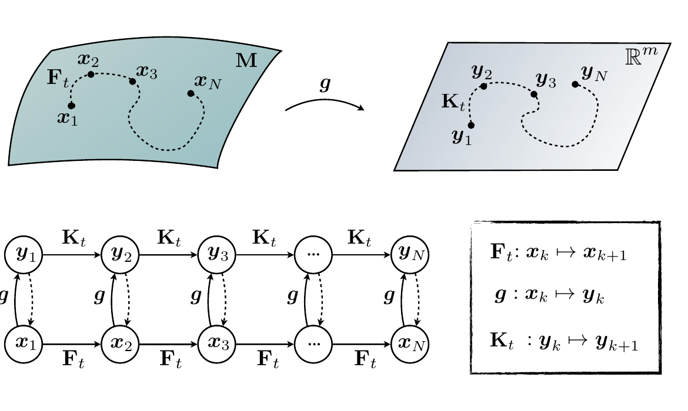
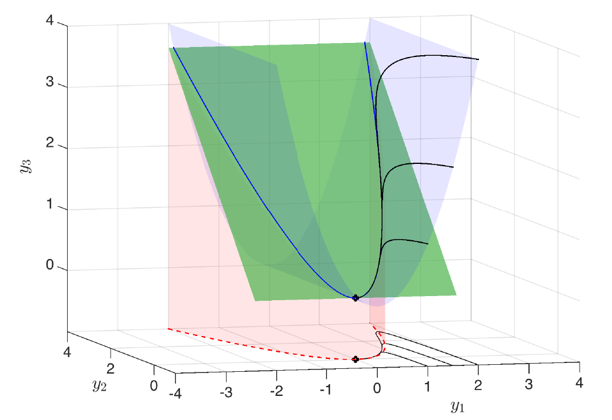

## Do estado às medições {.small-slide}

Dinâmica não linear, em tempo contínuo ou discreto (§7.1):
$$
\frac{d}{dt}\mathbf{x} = \mathbf{f}(\mathbf{x}), \qquad\qquad \mathbf{x}_{k+1} = \mathbf{F}(\mathbf{x}_k), \qquad \mathbf{x} \in M.
$$

Em vez de acompanhar o estado $\mathbf{x}$, Koopman olha para a evolução de **medições** $g(\mathbf{x})$ do estado.

::: {.callout-note title="Koopman (1931)"}
Um sistema dinâmico não linear pode ser representado por um **operador linear de dimensão infinita**, que age sobre um espaço de Hilbert de funções de medição do estado.
:::

- **Linear:** sua decomposição espectral caracteriza completamente o comportamento do sistema não linear.
- **Dimensão infinita:** são infinitos os graus de liberdade para descrever todas as funções de medição $g$.
- Aproximações **matriciais de dimensão finita** prometem representações **globalmente lineares** de sistemas não lineares, abrindo caminho para as técnicas de estimação e controle ótimo de sistemas lineares (Cap. 8).

## Formulação matemática {.small-slide}

**Observáveis:** funções $g: M \to \mathbb{R}$, elementos de um espaço de Hilbert de dimensão infinita (em geral, as funções de quadrado integrável em $M$).

[O nome "observável" nada tem a ver com a **observabilidade** da teoria de controle.]{.small}

O operador de Koopman $\mathcal{K}_t$ avança as medições com o fluxo $\mathbf{F}_t$ da dinâmica:
$$
\mathcal{K}_t\, g = g \circ \mathbf{F}_t, \qquad (7.61)
$$
em que $\circ$ é a composição. Em tempo discreto, com passo $\Delta t$:
$$
\mathcal{K}_{\Delta t}\, g(\mathbf{x}_k) = g(\mathbf{F}_{\Delta t}(\mathbf{x}_k)) = g(\mathbf{x}_{k+1}), \qquad (7.62)
$$
isto é, um **sistema dinâmico linear** (de dimensão infinita) que avança a medição $g_k = g(\mathbf{x}_k)$:
$$
g(\mathbf{x}_{k+1}) = \mathcal{K}_{\Delta t}\, g(\mathbf{x}_k), \qquad (7.63)
$$
válido para **qualquer** observável $g$ e **qualquer** estado $\mathbf{x}_k$.

## Linearidade e gerador infinitesimal {.small-slide}

A linearidade vem da linearidade da soma no espaço de funções (não da dinâmica):
$$
\begin{aligned}
\mathcal{K}_t\big(\alpha_1 g_1(\mathbf{x}) + \alpha_2 g_2(\mathbf{x})\big) &= \alpha_1 g_1(\mathbf{F}_t(\mathbf{x})) + \alpha_2 g_2(\mathbf{F}_t(\mathbf{x})) \qquad &(7.64a)\\
&= \alpha_1 \mathcal{K}_t g_1(\mathbf{x}) + \alpha_2 \mathcal{K}_t g_2(\mathbf{x}). &(7.64b)
\end{aligned}
$$

Para dinâmicas suficientemente suaves, há o análogo em **tempo contínuo**:
$$
\frac{d}{dt} g = \mathcal{K} g, \qquad (7.65)
\qquad\qquad
\mathcal{K} g = \lim_{t \to 0} \frac{\mathcal{K}_t g - g}{t} = \lim_{t \to 0} \frac{g \circ \mathbf{F}_t - g}{t}, \qquad (7.66)
$$
em que $\mathcal{K}$ é o **gerador infinitesimal** da família a um parâmetro $\mathcal{K}_t$.

::: {.callout-warning title="Atenção"}
O próprio estado pode ser o observável, $g = \mathbf{x}$. Mas a representação simples de $\mathbf{x}$ numa base do espaço de Hilbert pode ficar **arbitrariamente complexa** quando iterada pela dinâmica: achar uma representação de $\mathcal{K}\mathbf{x}$ pode não ser simples.
:::

## O operador de Koopman: esquema {.nostretch .small-slide}

{width="75%" fig-align="center"}

$\mathbf{F}_t$ avança o estado na variedade $M$ (não linear); as medições $\mathbf{y}_k = \mathbf{g}(\mathbf{x}_k)$ evoluem por $\mathcal{K}_t$ (linear). As setas tracejadas $\mathbf{y}_k \to \mathbf{x}_k$: queremos poder **recuperar o estado original**. [Fig. 7.11 de Brunton & Kutz.]{.small}

## Autofunções de Koopman {.small-slide}

Em vez de todas as medições do espaço de Hilbert, buscam-se medições **especiais que evoluem linearmente** no tempo: as autofunções do operador.

::: {.callout-note title="Autofunção de Koopman"}
Tempo discreto, autovalor $\lambda$:
$$
\varphi(\mathbf{x}_{k+1}) = \mathcal{K}_{\Delta t}\, \varphi(\mathbf{x}_k) = \lambda\, \varphi(\mathbf{x}_k). \qquad (7.67)
$$
Tempo contínuo:
$$
\frac{d}{dt}\varphi(\mathbf{x}) = \mathcal{K}\varphi(\mathbf{x}) = \lambda\, \varphi(\mathbf{x}). \qquad (7.68)
$$
:::

Pela regra da cadeia, $\dfrac{d}{dt}\varphi(\mathbf{x}) = \nabla\varphi(\mathbf{x}) \cdot \dot{\mathbf{x}} = \nabla\varphi(\mathbf{x}) \cdot \mathbf{f}(\mathbf{x})$ (7.69); com (7.68), obtém-se uma **EDP** para a autofunção:
$$
\nabla\varphi(\mathbf{x}) \cdot \mathbf{f}(\mathbf{x}) = \lambda\, \varphi(\mathbf{x}). \qquad (7.70)
$$

A EDP pode ser resolvida por séries de Laurent ou, com dados, por regressão. **Mensagem central:** nas coordenadas $\varphi(\mathbf{x})$ a dinâmica não linear é **completamente linear**.

## Autofunções: exemplos imediatos {.small-slide}

- A função constante $\varphi = 1$ é autofunção trivial, com $\lambda = 0$, de todo sistema.
- Toda **quantidade conservada** é autofunção com $\lambda = 0$ (p.ex., a energia hamiltoniana de um sistema conservativo): uma extensão de Koopman do **teorema de Noether**.

Caso LIT, $\dot{\mathbf{x}} = \mathbf{A}\mathbf{x}$, conhecido da análise modal: se $\mathbf{w}$ é **autovetor à esquerda** de $\mathbf{A}$, $\ \mathbf{w}^{\mathsf T}\mathbf{A} = \lambda \mathbf{w}^{\mathsf T}$, então
$$
\varphi(\mathbf{x}) = \mathbf{w}^{\mathsf T}\mathbf{x}
\quad\Rightarrow\quad
\nabla\varphi \cdot \mathbf{f} = \mathbf{w}^{\mathsf T}\mathbf{A}\mathbf{x} = \lambda\, \mathbf{w}^{\mathsf T}\mathbf{x} = \lambda\,\varphi(\mathbf{x}).
$$

::: {.callout-tip title="Leitura em controle"}
No sistema linear, as autofunções de Koopman são as **coordenadas modais** e os autovalores são os **polos** ($s$ contínuo, $z = e^{s\Delta t}$ discreto). Koopman estende essa ideia a sistemas não lineares, trocando autovetores por autofunções.
:::

## Reticulado de autovalores {.small-slide}

Autofunções geram novas autofunções. Em tempo discreto, o **produto** de duas autofunções é autofunção:
$$
\mathcal{K}_t\big(\varphi_1(\mathbf{x})\varphi_2(\mathbf{x})\big) = \varphi_1(\mathbf{F}_t(\mathbf{x}))\,\varphi_2(\mathbf{F}_t(\mathbf{x})) = \lambda_1\lambda_2\, \varphi_1(\mathbf{x})\varphi_2(\mathbf{x}). \qquad (7.71)
$$
Em tempo contínuo, os autovalores se **somam**:
$$
\mathcal{K}(\varphi_1\varphi_2) = \frac{d}{dt}(\varphi_1\varphi_2) = \dot\varphi_1\varphi_2 + \varphi_1\dot\varphi_2 = (\lambda_1 + \lambda_2)\,\varphi_1\varphi_2. \qquad (7.72)
$$

- As autofunções formam um **monoide comutativo** sob o produto ponto a ponto (estrutura de grupo, sem exigir inversos): pode bastar um conjunto finito de autofunções **geradoras**.
- Os autovalores formam um **reticulado**. Ex.: em $\dot x = \lambda x$, $\ \varphi = x$ tem autovalor $\lambda$ e $\varphi^\alpha = x^\alpha$ tem autovalor $\alpha\lambda$.
- Contínuo $\leftrightarrow$ discreto: $\lambda \mapsto e^{\lambda t}$, e $\ e^{\lambda_1 t}e^{\lambda_2 t}\varphi_1\varphi_2 = e^{(\lambda_1+\lambda_2)t}\varphi_1\varphi_2$ (7.73). Aplicando (7.66) a uma autofunção:
$$
\lim_{t\to 0}\frac{\mathcal{K}_t\varphi - \varphi}{t} = \lim_{t\to 0}\frac{e^{\lambda t}\varphi - \varphi}{t} = \lambda\,\varphi. \qquad (7.74)
$$

## Decomposição em modos de Koopman {.small-slide}

Várias medições do sistema (no extremo, o estado inteiro: todas as tensões e correntes de uma rede) formam o vetor $\mathbf{g}(\mathbf{x}) = [g_1(\mathbf{x}) \ \cdots \ g_p(\mathbf{x})]^{\mathsf T}$ (7.75). Expandindo cada uma nas autofunções:
$$
g_i(\mathbf{x}) = \sum_{j=1}^{\infty} v_{ij}\,\varphi_j(\mathbf{x}) \quad (7.76)
\qquad\Rightarrow\qquad
\mathbf{g}(\mathbf{x}) = \sum_{j=1}^{\infty} \varphi_j(\mathbf{x})\,\mathbf{v}_j, \quad (7.77)
$$
com $\mathbf{v}_j$ o **$j$-ésimo modo de Koopman**. Em sistemas conservativos (hamiltonianos), $\mathcal{K}$ é unitário, as autofunções são ortonormais e $\mathbf{v}_j = [\langle\varphi_j, g_1\rangle \ \cdots \ \langle\varphi_j, g_p\rangle]^{\mathsf T}$ (7.78): uma **mudança de base**.

A dinâmica das medições fica
$$
\mathbf{g}(\mathbf{x}_k) = \mathcal{K}_{\Delta t}^{k}\,\mathbf{g}(\mathbf{x}_0) = \mathcal{K}_{\Delta t}^{k}\sum_{j=0}^{\infty}\varphi_j(\mathbf{x}_0)\mathbf{v}_j = \sum_{j=0}^{\infty}\mathcal{K}_{\Delta t}^{k}\varphi_j(\mathbf{x}_0)\mathbf{v}_j = \sum_{j=0}^{\infty}\lambda_j^{k}\,\varphi_j(\mathbf{x}_0)\,\mathbf{v}_j. \qquad (7.79)
$$

As triplas $\{(\lambda_j, \varphi_j, \mathbf{v}_j)\}_{j=0}^{\infty}$ são a **decomposição em modos de Koopman** (Mezić, 2005); muitas vezes, poucos termos dominantes bastam.

## Modos de Koopman e DMD {.small-slide}

Com medições diretas do estado, $\mathbf{g}(\mathbf{x}) = \mathbf{x}$, os modos de Koopman são padrões coerentes que evoluem com a mesma dinâmica temporal (oscilações, com crescimento ou decaimento): os **modos dinâmicos** da DMD (§7.2).

| Koopman (7.79) | DMD (7.28) |
|:---|:---|
| autovalores $\lambda_j$ | autovalores DMD |
| modos de Koopman $\mathbf{v}_j$ | modos DMD $\boldsymbol{\phi}_j$ |
| autofunções na condição inicial, $\varphi_j(\mathbf{x}_0)$ | amplitudes $b_j$ |

::: {.callout-warning title="Objetos distintos"}
Modos e autofunções de Koopman são objetos matemáticos **diferentes**, que pedem aproximações diferentes. As autofunções costumam ser **mais difíceis** de calcular do que os modos, o que motiva técnicas como a DMD estendida (§7.5).
:::

## Subespaços invariantes e modelos finitos {.small-slide}

::: {.callout-note title="Subespaço Koopman-invariante"}
$\operatorname{span}\{g_1, \dots, g_p\}$ é **Koopman-invariante** se toda função do subespaço,
$$
g = \alpha_1 g_1 + \alpha_2 g_2 + \cdots + \alpha_p g_p, \qquad (7.80)
$$
permanece nele após a ação do operador:
$$
\mathcal{K} g = \beta_1 g_1 + \beta_2 g_2 + \cdots + \beta_p g_p. \qquad (7.81)
$$
:::

- Restrito a um subespaço invariante, $\mathcal{K}$ vira uma **matriz** $\mathbf{K}$ agindo em $\mathbb{R}^p$, nas coordenadas $g_j(\mathbf{x})$: um sistema linear de dimensão finita, como (7.63) e (7.65).
- Qualquer conjunto finito de **autofunções** gera um subespaço invariante; descobri-las é o desafio central (são as coordenadas intrínsecas em que a dinâmica é linear).
- Na prática, obtém-se um subespaço **aproximadamente** invariante: cada $g_j \approx \sum_{k=0}^{p} \alpha_k \varphi_k$.

## Exemplo: ponto fixo e variedade lenta {.small-slide}

Sistema não linear com um único ponto fixo:
$$
\dot x_1 = \mu x_1, \qquad \dot x_2 = \lambda\,(x_2 - x_1^2). \qquad (7.82)
$$

Para $\lambda < \mu < 0$, há uma **variedade lenta atratora** $x_2 = x_1^2$. Acrescentando ao estado a medição não linear $g = x_1^2$, obtém-se um subespaço Koopman-invariante de dimensão 3, em que a dinâmica é **linear**:
$$
\frac{d}{dt}\begin{bmatrix} y_1\\ y_2\\ y_3 \end{bmatrix}
=
\begin{bmatrix} \mu & 0 & 0\\ 0 & \lambda & -\lambda\\ 0 & 0 & 2\mu \end{bmatrix}
\begin{bmatrix} y_1\\ y_2\\ y_3 \end{bmatrix}
\qquad\text{com}\qquad
\begin{bmatrix} y_1\\ y_2\\ y_3 \end{bmatrix}
=
\begin{bmatrix} x_1\\ x_2\\ x_1^2 \end{bmatrix}. \qquad (7.83)
$$

::: {.callout-tip title="Por que fecha?"}
$\dfrac{d}{dt}(x_1^2) = 2x_1\dot x_1 = 2\mu\,x_1^2$: a nova medição evolui como combinação linear de medições que **já estão** no conjunto. Os autovalores $\mu$, $\lambda$ e $2\mu$ ilustram o reticulado ($2\mu = \mu + \mu$).
:::

## A geometria do exemplo {.nostretch .small-slide}

:::: {.columns}
::: {.column width="55%"}
{width="100%"}

[Fig. 7.12 de Brunton & Kutz.]{.small}
:::
::: {.column width="45%"}
- **Azul:** a restrição $y_3 = y_1^2$; trajetórias que começam nela ficam nela.
- **Verde:** o subespaço **lento**, gerado pelos autovetores de $\mu$ e $2\mu$.
- **Vermelho:** a variedade atratora original, $y_2 = y_1^2$.
- As superfícies azul e vermelha se cruzam numa parábola inclinada a $45^\circ$ na direção $y_2$–$y_3$; a verde tende a essa inclinação quando a razão entre dinâmica rápida e lenta cresce.
- No espaço dos observáveis há **um nó estável**: as trajetórias caem rapidamente no plano verde e depois se aproximam lentamente do ponto fixo.
:::
::::

## Coordenadas intrínsecas {.small-slide}

Os **autovetores à esquerda** da matriz de Koopman dão as autofunções (os "auto-observáveis"). Para (7.83), com autovalores $\mu$ e $\lambda$:
$$
\varphi_\mu = x_1 \qquad\text{e}\qquad \varphi_\lambda = x_2 - b\,x_1^2, \qquad b = \frac{\lambda}{\lambda - 2\mu}. \qquad (7.84)
$$

- A constante $b$ mostra que, para uma razão $\lambda/\mu$ finita, a dinâmica apenas **acompanha de perto** a variedade lenta $x_2 = x_1^2$, seguindo parábolas vizinhas.
- Em geral, num subespaço invariante:
$$
\varphi_\alpha(\mathbf{x}) = \boldsymbol{\xi}_\alpha\, \mathbf{y}(\mathbf{x}), \qquad \text{em que} \qquad \boldsymbol{\xi}_\alpha \mathbf{K} = \alpha\, \boldsymbol{\xi}_\alpha. \qquad (7.85)
$$
- Esses auto-observáveis definem subespaços que continuam invariantes mesmo após mudanças de coordenadas: são **coordenadas intrínsecas** no subespaço Koopman-invariante.

[Verificação de (7.84) por (7.70): $\ \dfrac{d}{dt}(x_2 - b x_1^2) = \lambda x_2 - (\lambda + 2b\mu)\,x_1^2$, que vale $\lambda(x_2 - b x_1^2)$ se, e só se, $b(\lambda - 2\mu) = \lambda$.]{.small}

## Verificação numérica do exemplo {.small-slide}

::: {.panel-tabset}

### Python

```{python}
#| echo: true
import numpy as np
from scipy.integrate import solve_ivp
from scipy.linalg import expm

mu, lam = -0.05, -1.0
f = lambda t, x: [mu * x[0], lam * (x[1] - x[0]**2)]          # (7.82)
K = np.array([[mu, 0, 0], [0, lam, -lam], [0, 0, 2 * mu]])     # (7.83)

x0 = np.array([2.0, -1.0])
t = np.linspace(0, 20, 201)
x = solve_ivp(f, (0, 20), x0, t_eval=t, rtol=1e-10, atol=1e-12).y
y0 = np.array([x0[0], x0[1], x0[0]**2])
y = np.stack([expm(K * tk) @ y0 for tk in t], axis=1)          # modelo linear

print(np.max(np.abs(y[:2] - x)))                               # ~ 0
b = lam / (lam - 2 * mu)
phi = x[1] - b * x[0]**2                                       # (7.84)
print(np.max(np.abs(phi - np.exp(lam * t) * phi[0])))          # ~ 0
```

### MATLAB

```matlab
mu = -0.05; lam = -1;
f = @(t,x) [mu*x(1); lam*(x(2) - x(1)^2)];                     % (7.82)
K = [mu 0 0; 0 lam -lam; 0 0 2*mu];                            % (7.83)

x0 = [2; -1];
t = linspace(0, 20, 201);
opts = odeset('RelTol',1e-10,'AbsTol',1e-12);
[~, x] = ode45(f, t, x0, opts);  x = x.';
y0 = [x0; x0(1)^2];
y = cell2mat(arrayfun(@(tk) expm(K*tk)*y0, t, 'UniformOutput', false));

disp(max(abs(y(1:2,:) - x), [], 'all'))                        % ~ 0
b = lam/(lam - 2*mu);
phi = x(2,:) - b*x(1,:).^2;                                    % (7.84)
disp(max(abs(phi - exp(lam*t)*phi(1))))                        % ~ 0
```

:::

O modelo **linear** de dimensão 3 reproduz **exatamente** a trajetória do sistema **não linear**.

## Trajetórias e autofunções {.nostretch .small-slide}

```{python}
#| echo: false
#| fig-align: center
import matplotlib.pyplot as plt
plt.rcParams.update({"font.size": 14})

fig, (a1, a2) = plt.subplots(1, 2, figsize=(14, 5.2))
xs = np.linspace(-2.6, 2.6, 200)
a1.plot(xs, xs**2, color="tab:red", lw=2, label="variedade lenta $x_2 = x_1^2$")
for x0i in ([2.0, -1.0], [-2.2, 0.5], [1.2, 5.0], [-1.0, 6.0]):
    xi = solve_ivp(f, (0, 60), x0i, t_eval=np.linspace(0, 60, 601), rtol=1e-10).y
    y0i = np.array([x0i[0], x0i[1], x0i[0]**2])
    yi = np.stack([expm(K * tk) @ y0i for tk in np.linspace(0, 60, 31)], axis=1)
    a1.plot(xi[0], xi[1], "k", lw=1.4)
    a1.plot(yi[0], yi[1], "o", color="tab:blue", ms=5, mfc="none")
    a1.plot(*x0i, "ks", ms=6)
a1.plot([], [], "k", label="EDO não linear (7.82)")
a1.plot([], [], "o", color="tab:blue", mfc="none", label="modelo linear (7.83)")
a1.plot(0, 0, "k*", ms=12)
a1.set_xlabel("$x_1$"); a1.set_ylabel("$x_2$"); a1.set_xlim(-2.6, 2.6); a1.set_ylim(-1.5, 9.8)
a1.legend(loc="upper center", fontsize=12, ncol=2); a1.set_title("plano de fase ($\\mu=-0.05$, $\\lambda=-1$)")

a2.semilogy(t, np.abs(x[0]), color="tab:blue", lw=2, label="$|\\varphi_\\mu(\\mathbf{x}(t))| = |x_1|$")
a2.semilogy(t, np.abs(phi), color="tab:orange", lw=2, label="$|\\varphi_\\lambda(\\mathbf{x}(t))| = |x_2 - b x_1^2|$")
a2.semilogy(t, np.abs(x[1]), "--", color="gray", lw=1.5, label="$|x_2(t)|$ (não é autofunção)")
a2.set_xlabel("$t$"); a2.set_ylim(1e-9, 10)
a2.set_title("autofunções decaem como $e^{\\mu t}$ e $e^{\\lambda t}$ (retas)")
a2.legend(loc="lower left", fontsize=12)
plt.tight_layout()
plt.show()
```

Em escala log, cada autofunção é uma **reta** de inclinação igual ao seu autovalor; o estado $x_2$ não é.

## Representação intratável: mapa logístico {.small-slide}

$$
x_{k+1} = \beta x_k (1 - x_k). \qquad (7.86)
$$

Com o subespaço de observáveis $\mathbf{y}_k = [x \ \ x^2]^{\mathsf T}_k$ (7.87), a primeira linha é simples, a segunda não:
$$
\begin{bmatrix} x \\ x^2 \end{bmatrix}_{k+1} = \begin{bmatrix} \beta & -\beta \\ ? & ? \end{bmatrix}\begin{bmatrix} x \\ x^2 \end{bmatrix}_k, \qquad (7.88)
\qquad
x_{k+1}^2 = \big(\beta x_k(1-x_k)\big)^2 = \beta^2\big(x_k^2 - 2x_k^3 + x_k^4\big). \qquad (7.89)
$$

- Avançar $x^2$ exige $x^3$ e $x^4$; estes exigem polinômios até ordem 6 e 8, e assim por diante, *ad infinitum*: **não há fechamento**.
- As linhas da matriz se relacionam com o triângulo de Pascal; e $[x^0]_{k+1} = [0]\,[x^0]_k$ (7.90).
- O determinante de qualquer truncamento de posto finito é muito grande para $\beta > 1$.

::: {.callout-warning title="Armadilha"}
Truncar o sistema, ou ajustar por mínimos quadrados sobre um vetor aumentado de medições (DMD sobre medições não lineares, §7.5), dá maus resultados: o modelo truncado concorda com a dinâmica real só por umas poucas iterações.
:::

## A complexidade cresce a cada iteração {.small-slide}

Aplicando $\mathcal{K}$ repetidamente ao observável $x$, na base de monômios $1, x, x^2, x^3, \dots$:
$$
\begin{bmatrix} 0\\1\\0\\0\\0\\0\\\vdots \end{bmatrix}
\overset{\mathcal{K}}{\Longrightarrow}
\begin{bmatrix} 0\\ \beta\\ -\beta\\ 0\\ 0\\ 0\\ \vdots \end{bmatrix}
\overset{\mathcal{K}}{\Longrightarrow}
\begin{bmatrix} 0\\ \beta^2\\ -\beta^2-\beta^3\\ 2\beta^3\\ -\beta^3\\ 0\\ \vdots \end{bmatrix}
\overset{\mathcal{K}}{\Longrightarrow}
\begin{bmatrix} 0\\ \beta^3\\ -\beta^3-\beta^4-\beta^5\\ 2\beta^4+2\beta^5+2\beta^6\\ -\beta^4-\beta^5-6\beta^6-\beta^7\\ 6\beta^6+4\beta^7\\ \vdots \end{bmatrix}
\quad (7.91)
$$

(no último vetor seguem $-2\beta^6-6\beta^7$, $4\beta^7$ e $-\beta^7$ para $x^6$, $x^7$ e $x^8$).

- Após $k$ iterações, $x_k$ é um polinômio de grau $2^k$ em $x_0$: o número de observáveis necessários **dobra a cada passo**.
- Lição: a escolha **ingênua** de base (polinômios) para representar $\mathcal{K}$ num sistema caótico simples é problemática; é preciso buscar boas coordenadas (autofunções).

## Séries analíticas para autofunções {.small-slide}

Resolver a EDP (7.70) recursivamente, com séries de Taylor ou de Laurent:

**Dinâmica linear**, $\dot x = x$ (7.92). Com $\varphi(x) = c_0 + c_1x + c_2x^2 + \cdots$, $\ \nabla\varphi\cdot f = c_1x + 2c_2x^2 + 3c_3x^3 + \cdots$. Então $c_0 = 0$ e, para $\lambda = k \in \mathbb{Z}^+$, só um coeficiente é não nulo: $\varphi(x) = c\,x^k$ (p.ex., $\lambda = 1 \Rightarrow \varphi = x$).

**Dinâmica quadrática**, $\dot x = x^2$ (7.93). Nenhuma série de Taylor serve (exceto $\varphi = 0$); com uma série de Laurent, $c_k = 0$ para $k \geq 1$ e $\lambda c_{k+1} = k\,c_k$ para $k \leq -1$:
$$
\varphi(x) = c_0\left(1 - \lambda x^{-1} + \frac{\lambda^2}{2}x^{-2} - \frac{\lambda^3}{3!}x^{-3} + \cdots\right) = c_0\, e^{-\lambda/x}, \qquad \lambda \in \mathbb{C}.
$$

**Dinâmica polinomial**, $\dot x = a x^n$ (7.94):
$$
\varphi(x) = \exp\!\left(\frac{\lambda}{(1-n)a}\,x^{1-n}\right), \qquad \lambda \in \mathbb{C}.
$$

Potências dessas autofunções primitivas geram novas autofunções; os autovalores formam um reticulado no plano complexo.

[Conferência para $\dot x = x^2$: a solução é $x(t) = x_0/(1 - x_0t)$, logo $\ e^{-\lambda/x(t)} = e^{-\lambda/x_0 + \lambda t} = e^{\lambda t}\,\varphi(x_0)$.]{.small}

## Histórico e conexões {.small-slide}

- **1931:** Koopman, para medições de sistemas hamiltonianos; **1932:** Koopman e von Neumann, espectro contínuo. No caso hamiltoniano, $\mathcal{K}_t$ é **unitário** (como a DFT e a SVD): preserva o produto interno entre observáveis, ligado à preservação de volume no espaço de fase. O artigo de 1931 foi central nas provas do teorema ergódico (Birkhoff, von Neumann).
- **Renascimento:** trabalhos de Mezić e colaboradores (a decomposição em modos de Koopman é de 2005).
- $\mathcal{K}$ é o **operador de composição** (*pull-back* nas funções escalares) e o dual (adjunto à esquerda) do operador de **Perron–Frobenius** (*push-forward* nas densidades de probabilidade).
- Em base polinomial, liga-se à **linearização de Carleman**, muito usada em **controle não linear**.
- Conjuntos de nível das autofunções formam partições invariantes do espaço de estados; a análise de Koopman generaliza o **teorema de Hartman–Grobman** a toda a bacia de atração de um equilíbrio ou órbita periódica.

::: {.callout-note title="Em aberto"}
Representar autofunções de Koopman de sistemas gerais continua um desafio central. As próximas seções tratam de identificá-las a partir de **dados** (DMD estendida, SINDy, coordenadas de atraso, aprendizado profundo) e de usá-las para **controle**.
:::


